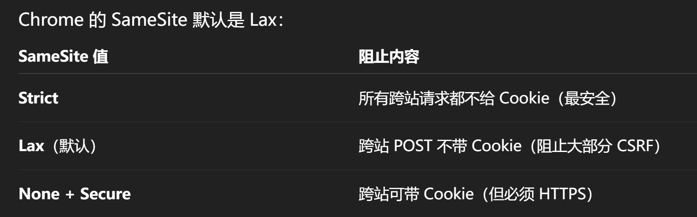
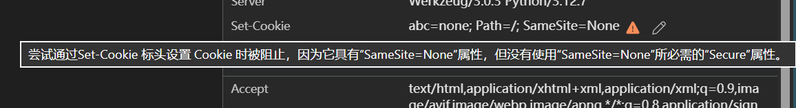

## 浏览器管理Cookie原理

浏览器会自动处理服务器的响应Set-Cookie, 一个Set-Cookie可以分为两部分。
**第一个键值对是浏览器实际保存的数据, 后续的键值对是告诉浏览器如何管理这个数据**。在发送请求时，如果符合条件, 则会自动在请求中添加Cookie以实现状态保存。

以如下响应头为例：
`Set-Cookie: JSESSIONID=bd074903-2985-4fae-91ce-d6f55200820f; Path=/samples_web; Secure; HttpOnly; SameSite=none; Path=/samples_web; Max-Age=0; Expires=Sun, 23-Nov-2025 14:35:18 GMT;`
说明一些浏览器可以识别的Cookie管理设置。

实际数据： `JSESSIONID=bd074903-2985-4fae-91ce-d6f55200820f;`
后面都是管理设置

## HttpOnly

表示仅在http协议(包括https)中使用这个cookie
**防御的攻击场景: xss**
防止xss, 设置了HttpOnly的Cookie, 浏览器中执行的js代码就不能读取cookie了
eg. ``

## SameSite

表示仅在发送请求的网站与目标网站为同一个站时, 添加Cookie
**samesite的可选值:**

**攻击场景: csrf**
假设用户登陆了bank.com, 保存了`cookie: sessid=<uuid>`
用户访问了恶意网站或被xss注入js代码的网站`evil.com`, 比如

```js
fetch("https://bank.com/transfer", {
  method: "POST",
  headers: { "Content-Type": "application/json" },
  body: JSON.stringify({ to: "attacker", amount: 10000 }),
  credentials: "include",
});
```

访问后自动向`bank.com`发送http请求, 转账给攻击者。
这是候浏览器就会在发送请求的时候检查这个Cookie的设置，如果设置了`SameSite=strict`, 浏览器判断发起请求的页面`evil.com`不等于目标页面`bank.com`, 不会加cookie。防止了csrf
**question:**
如果bank.com被xss注入js代码会怎么样?
**A:**
跨域检测CORS， evil.com中的js代码只能向`本网站或白名单的网站`发起请求

SameSite为None时, 必须搭配Secure使用



## Secure字段

仅在https下加入Cookie
**防御场景：响应窃取**
有很多种方法获取其他人的响应。比如：

1.  使用 ARP poisoning、WiFi sniffing（最常见）
2.  使用代理劫持（ISP、恶意中间节点）

如果使用http明文传输， 响应被侦听到，Cookie就泄露了。
