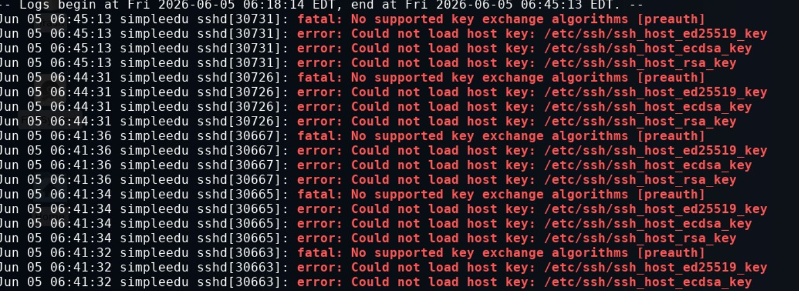

## 公私钥登陆

```
~/.ssh/authorized_keys
```
这个文件里放公钥列表
```
ssh-ed25519 AAAAC3NzaC1lZDI1NTE5AAAAIC8goz/DRcu1Dd1pSTqZvjg96DJNOf4z/KPW5ogJ0tiz
```
格式是`算法 公钥 [来源]`

**公钥登陆原理**

SSH提供两种登录验证方式，一种是口令验证也就是账号密码登录，另一种是公钥认证。

所谓公钥认证，其实就是一种基于非对称密码的认证，使用公钥加密、私钥解密，其中公钥是可以公开的，放在服务器端，你可以把同一个公钥放在所有你想SSH远程登录的服务器中，而私钥是保密的只有你自己知道，公钥加密的消息只有私钥才能解密，大体过程如下：

1. 客户端通过ssh-keygen生成私钥和公钥，将公钥拷贝给服务器端
2. 客户端发起登录请求
3. 服务器端根据客户端发来的信息(用户名和ip)查找是否存有该客户端的公钥，如果有，发送一个用公钥加密后的随机数给客户端，仅有拥有私钥的人才能解密
4. 客户端收到服务器发来的加密后的消息后使用私钥解密，并把解密后的结果发给服务器用于验证
5. 服务器收到客户端发来的解密结果，与自己刚才生成的随机数比对，如果一致，则验证通过，允许客户端登陆


## debug 
Connection closed by ...不是连接不上，而是由于某些错误服务端中断了连接，可以 -v 查看一下详情



服务端日志出现这种情况表示服务端缺少用于密钥交换的公私钥对，从而无法建立连接，通过ssh-keygen -A解决
