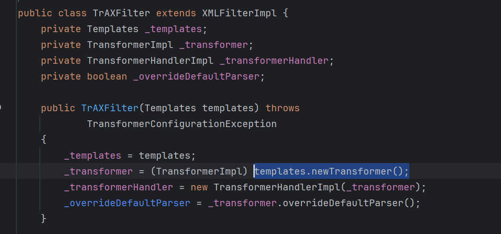
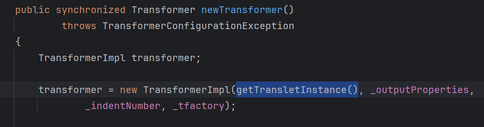
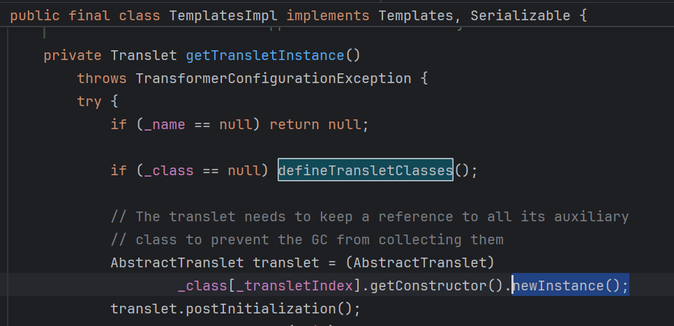

## 实例化任意类，参数可控

`TrAXFilter`类，这个类存在于JDK中（已知JDK21仍然是这样）
初始化时，调用传入的`templates`的newTransformer()方法

这个函数可以触发字节码加载

`newTransformer->getTransletInstance->defineTranslateClass->defineClass(bytecodes)`
或者加载字节码后实例化

## abc
