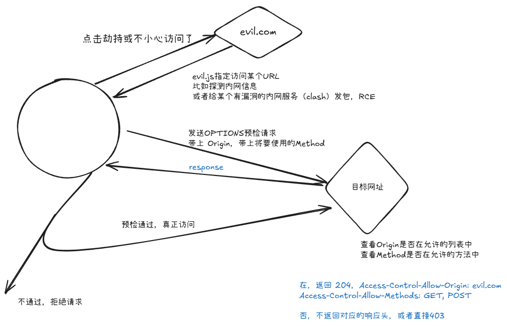

CSP、同源策略是**浏览器**为了防御一些攻击而引入的安全策略

## CSP

content Security Policy，通过http响应头决定本网站可以加载哪些资源

主要解决的是XSS相关的安全问题

绕过方式：待学习 https://mdr.skyeye.qianxin.com/forum/share/4535

## 同源策略

same origin policy
协议、域名或IP、端口都一致，才叫做同源

当js访问不同源的资源的时候，分简单请求和非简单请求。

对于简单请求，浏览器会直接访问目标网站，然后根据响应中Access-Control-Allow-Origin头部分，决定是否将响应内容交给JS

对于非简单请求，浏览器会先发送预检请求，查询目标网站的CORS，如果允许这个Origin访问，则发送真实请求，否则拒绝发送。具体见下文CORS部分。

## CORS

cross Origin resource sharing，决定是否允许来自某个Origin的js代码访问本网站内容。

非简单请求时同源策略和CORS搭配使用的流程如下：

同源策略是浏览器的安全策略，而CORS决定某个Origin是否能被某个来源的js访问。二者配合，即保证了一定的安全性，也不会妨碍正常的功能。
