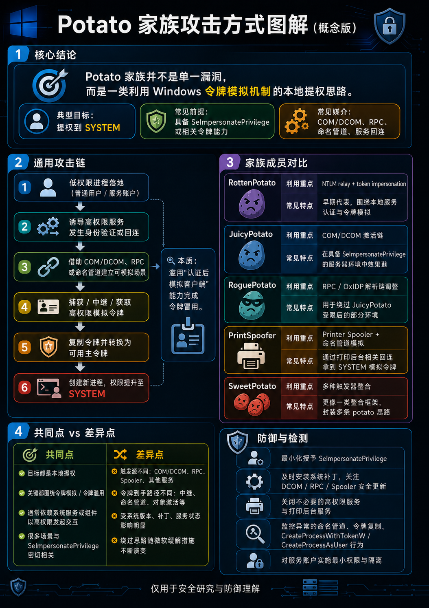
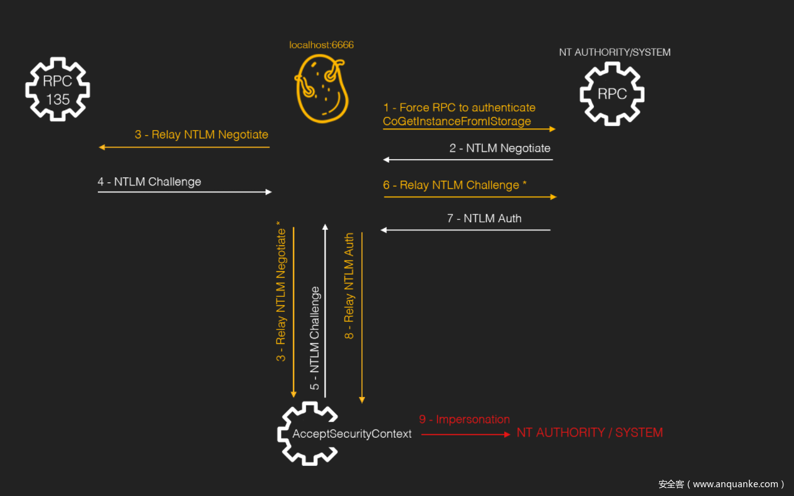

# rotten potato
**利用条件:**
< windows 10

通过NTLM challenge转发实现中间人攻击

# printspoofer
**利用条件：**

1. whoami /priv => SeImpersonatePrivilege为enabled 或拥有SeAssignPrimaryTokenPrivilege
（看看用fullpower能不能获得更多权限）
2. spoofer服务存在
`get-service -name spooler` 或 `sc query Spooler`

**原理：**
调用 Spooler 的 MS-RPRN RPC 接口，在“打印变更通知”请求里传入伪造的客户端地址（攻击者创建的命名管道服务），spooler就会去连接这个命名管道并认证，而用户有SeImpersonatePrivilege权限，可以模拟作为客户端的spooler服务，再通过模拟令牌转换为主令牌创建新进程，从而拿到system shell。

PrintSpoofer64 -i -c powershell.exe