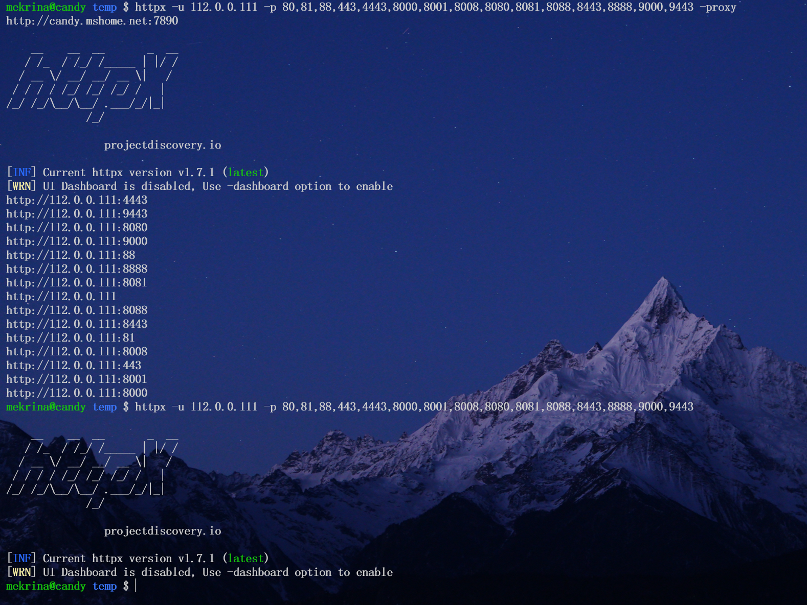

# 资产扫描步骤

## 收集资产
有域名的用域名，没有域名用ip

可能全用ip C段更好，资产更全（如果能先探测一下存活主机会节省一些时间，httpx会对每一个ip的每一个端口进行探测，浪费）

## fscan（发现-hf扫描不了。。）（可选）
扫端口
非web服务，如mysql，密码爆破

-hf参数扫描不了，nmap也扫描不了，可能是因为服务器识别了扫描器并拒绝了端口扫描的请求（不响应）

没办法只能先跳过这一步

可以考虑-np参数，不用ping探测主机是否存活，可以发现屏蔽了ping的服务

## httpx找出web服务
从fscan的搜索结果中检索service=http（如果fscan没有扫描出来，那么用httpx识别web服务）
`cat /mnt/d/test/hosts | httpx -ports 80,443,8080,8443,8000,8888,8081,8001,8088,81,88,4443,7001,7002,9000,9090,5601,5000,8181,9443,3000,9200,9300 -title -status-code -tech-detect -server -filter-code 502 -no-color | tee httpx_result.txt`
j
注意用代理的话要过滤响应，不然会多很多无用的端口（响应是代理的页面）（好像只有127开头的会这样）

这个hosts可以长这样
127.0.0.0/24扫描整个C段中存活主机开放的端口

去掉http跳转https的url `http[^s].*?Moved Permently.*\n`  ？

## nuclei扫描
cut -d ' ' -f 1 httpx_result.txt > visitable_sites
nuclei -l visitable_sites -proxy http://candy.mshome.net:7890 -pd | tee nuclei_result.txt

**扫描记得加代理！！！**

## SQL注入

可能在小众的查询点

## 越权

个人信息查看的地方